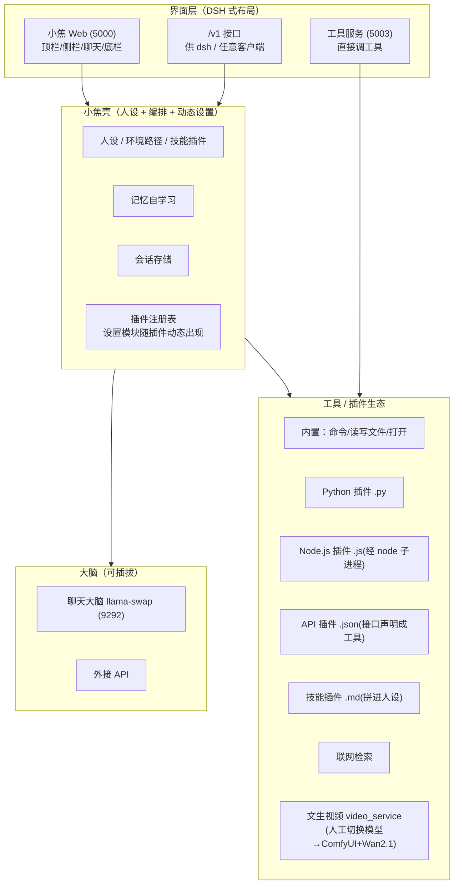
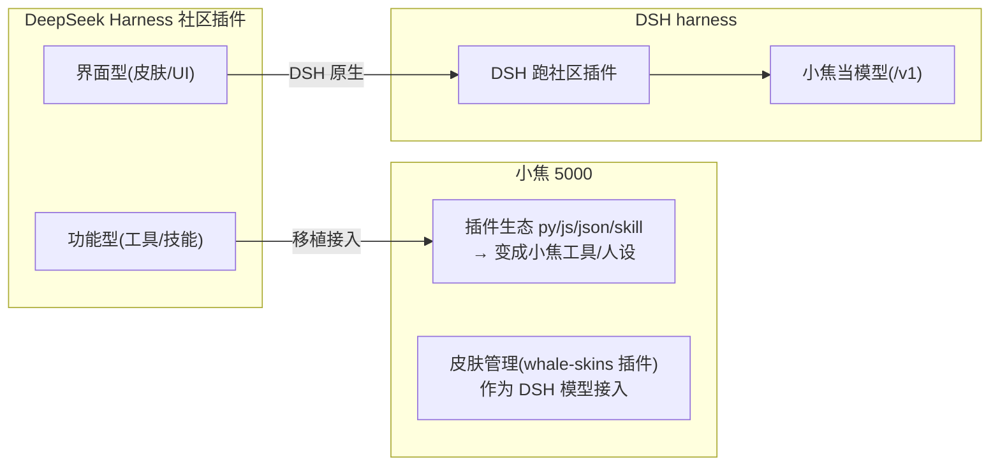
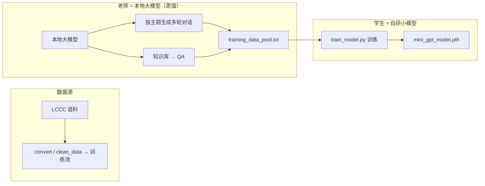
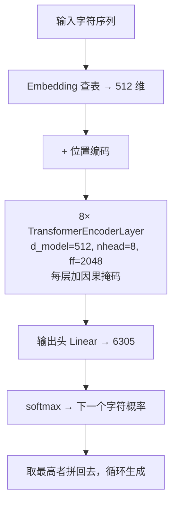
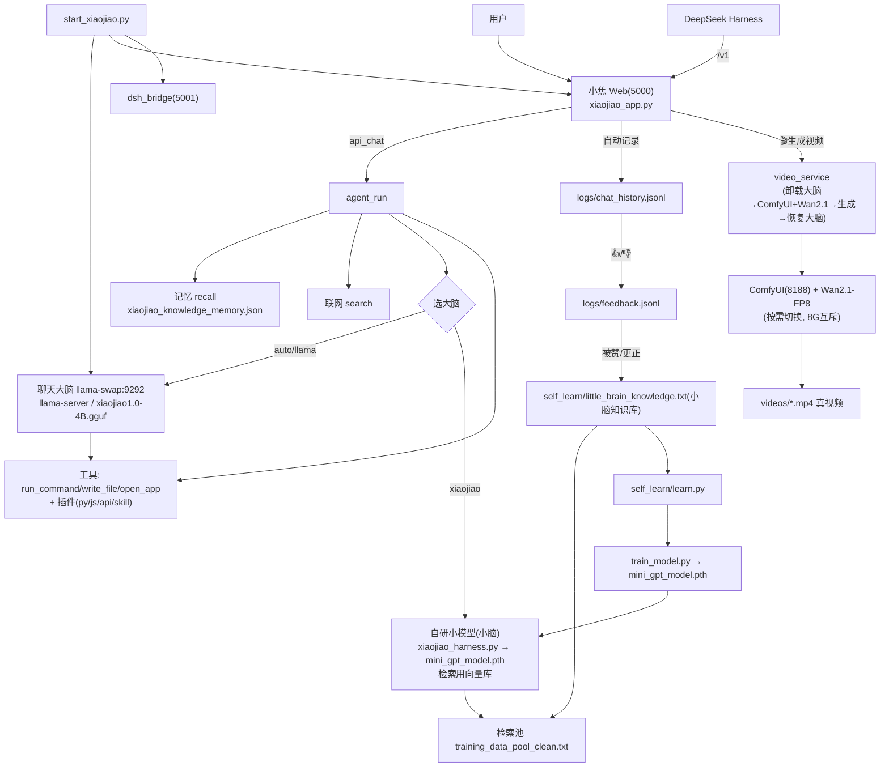
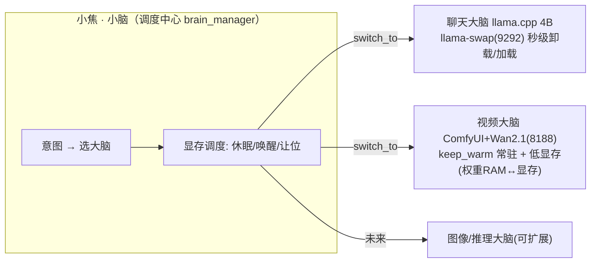
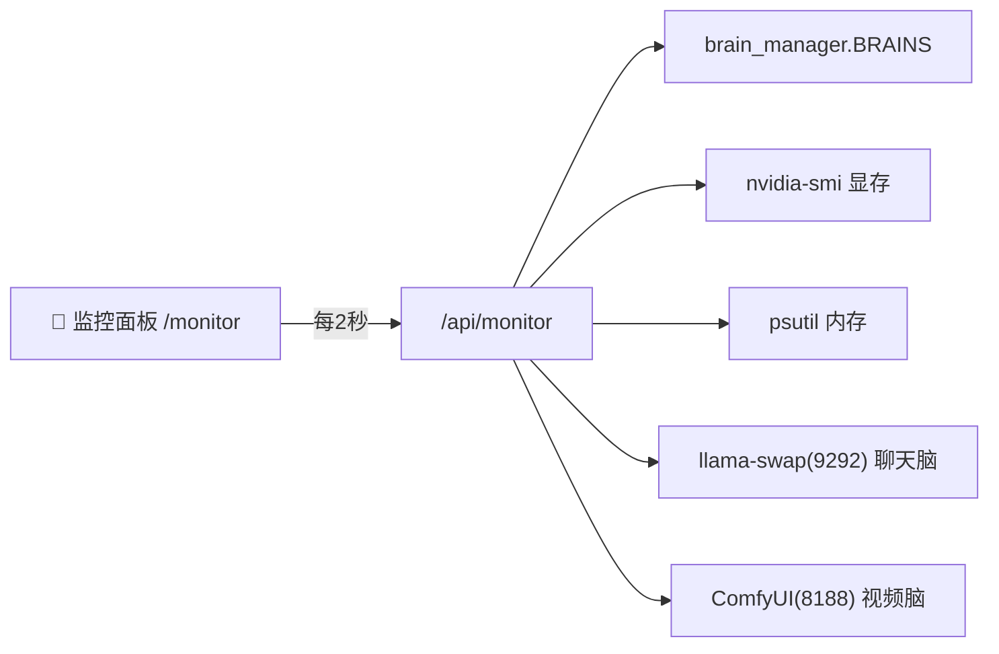

<div align="center">

# 🧡 小焦 · XiaoJiao

<br>

### 把一个大模型当底座，套上人格、工具、记忆、联网 —— 做成一个能陪你聊天、也能帮你干活儿的本地 AI 助手。

<br>

`Python` · `PyTorch` · `Flask` · `llama.cpp` ·

[](LICENSE)
[]()
[]()
[](https://github.com/jiangchuangege/xiaojiao-harness/releases/tag/v1.0.0)

</div>

---

> 🧠 自研小模型 · 💬 聊天 · 🌐 联网搜索 · 💾 记忆 · 🛠️ 工具 · 🧩 四类插件生态(py/js/api/skill) · 🔌 DSH 社区插件兼容 · 🧠 持续学习 · 🔗 DSH 接入小焦

## 📖 先说一句

**DeepSeek Harness 插件生态伙伴 · 本地 AI 助手（dsh-plugin / deepseek-harness-plugin）**

> **关键词**：DeepSeek Harness 插件 · dsh plugin · DeepSeek Harness 皮肤插件 · 本地AI助手 · LLM Agent · OpenAI 兼容接口 · 功能调用 · 插件生态(Python/Node.js/API/技能) · 记忆 · 联网搜索 · 皮肤 · 鲸鱼娘皮肤 · xiaojiao · 小焦

小焦是把大模型当底座、自己套了一层人格和工具链的本地 AI 助手。你可以让它聊天、联网、记东西，也能让它帮你建文件、写网页、跑命令、**生成真视频**。它还有一套**多大脑·秒级切换**：聊天大脑、视频大脑（未来还有图像/推理大脑）按需热切换（llama-swap + keep_warm + 低显存，权重 RAM↔显存），**切换秒级、ComfyUI 进程常驻**。**兼容 DeepSeek Harness 社区插件**——功能型插件可移植接入小焦，界面型插件在 DSH 里用、小焦当模型，支持 `dsh-plugin` 生态。下面把它的用法、原理、玩法都给你列全。

---

## ✨ 它能干嘛

| 分类 | 功能 | 一句话 |
| --- | --- | --- |
| 🧠 | **自研蒸馏小模型** | 大模型蒸馏出属于你自己的小脑（项目核心） |
| 💬 | **聊天** | 像正常人，不会答着答着就背课文 |
| 🌐 | **联网搜索** | 把关键信息揉进回答，不甩一堆网址 |
| 💾 | **记忆自学习** | 你教过它的它会记住，下次能想起来 |
| 🛠️ | **工具调用** | 让你建文件/写网页/跑命令，它真去执行 |
| 🤖 | **多步执行** | 自己推理"建目录→写文件→打开"，分步干活 |
| 🔒 | **危险命令确认** | 碰到 `rm/del/format` 之类，先问你要不要 |
| 🧩 | **四类插件生态** | Python / Node.js / API / 技能，通吃多生态插件 |
| 🔌 | **DeepSeek Harness 社区插件兼容** | 功能型插件可移植接入小焦；DSH 界面插件 DSH 用、小焦当模型 |
| 🧾 | **插件驱动设置模块** | 装了什么插件，设置里就自动出现对应模块（像 DSH） |
| 🔌 | **DeepSeek Harness 接入** | 提供 /v1，可作为 DSH 的模型接入 |
| 🖥️ | **DSH 式网页布局** | 顶栏/侧栏/底栏/设置导航，和 DSH 一致 |
| 💬 | **多会话** | 每个新对话一个会话，左边切换 |
| 🎛️ | **模型管理** | 顶部下拉切模型，设置里增删模型 |
| 🔗 | **OpenAI 兼容** | `/v1` 接口，dsh / 任意客户端能接 |
| 🎬 | **真·文生视频** | 本地 ComfyUI+Wan2.1 真生成（8G按需切换、进度条、刷新不丢） |
| ⚡ | **多大脑·秒级切换** | llama-swap + keep_warm + 低显存(权重RAM↔显存)，聊天/视频/未来大脑秒切、ComfyUI 进程常驻 |
| 🎭 | **Agent 预设** | 一键切换人格+大脑+工具开关（presets/，设置里卡片管理，Web 编辑/增删/保存即应用） |
| 🧠 | **大脑仓库监控面板** | 实时看所有大脑状态/显存/内存，直接切换·调优·添加大脑（`/monitor`，免写码） |

---

## 🚀 怎么跑（三行）

```powershell
cd C:\xiaojiao\xiaojiao harness
pip install -r requirements.txt
python start_xiaojiao.py
```

自动起聊天大脑(llama-swap:9292) + 网页(5000)，然后打开 `http://127.0.0.1:5000`。

> 手把手上手看 [docs/quickstart.md](docs/quickstart.md)。

---

## 🖥️ 用法

### 三种入口

| 想干嘛 | 连哪里 | 说明 |
| --- | --- | --- |
| 🖥️ **小焦网页** | `http://127.0.0.1:5000` | 聊天 + 联网 + 记忆 + 工具 + 会话 |
| 🔗 **接 dsh / 客户端** | `http://127.0.0.1:5000/v1` | OpenAI 兼容，自动带上小焦人格 + 工具 |
| 🛠️ **直接调工具** | `python xiaojiao_tools.py` → `:5003` | `POST /api/run`，给脚本用 |

### 常用操作

- **切模型**：顶部下拉；或 ⚙️设置 → 模型管理 → 添加。
- **开/关工具**：右上角「🛠️ 工具」（🟢开 / 🔴关）。
- **建会话**：左边「＋ 新对话」；点历史会话切换，右上角「⟨」收起侧边栏。
- **换端口**：`python start_xiaojiao.py --port 8081`，或改 `xiaojiao_control.json` 的 `web_port`。

---

## 🏗️ 原理

一句话：**用户消息 → 小焦（注入人设 + 取记忆 + 取会话）→ 交给大脑推理 → 大脑决定调工具/联网 → 执行并回显 → 记忆沉淀 + 会话存 → 回答**。



### 一条消息在内部怎么走

1. **注入人设 + 真实路径**（当前目录/桌面 + 技能插件内容）→ 这就是"小焦人格"生效的原因。

2. **取记忆**：从 `xiaojiao_knowledge_memory.json` 找相关历史知识。

3. **取会话**：拿最近 N 条对话当上下文。

4. **联网（可选）**：Bing/Sogou 抓关键信息注入。

5. **大脑推理**：`brain.engine` 决定用本地 llama / 外接 API。模型用 function-calling 想"要不要调工具、调哪个、参数是啥"。

6. **执行工具**：模型决定"建目录→写文件→打开"，框架逐个执行（内置/插件），显示工具轨迹；危险命令先挂起、等你点「✅ 确认执行」。

7. **记忆沉淀 + 会话存**。

8. **返回**：模型基于工具结果给一句简短总结。

> 更细的实现见 [docs/architecture.md](docs/architecture.md)。

---

## 🧩 插件生态 & DeepSeek Harness 社区插件兼容

小焦的**插件生态**支持四种类型，**装了什么插件，设置里就自动出现对应模块**（像 DSH 那样动态）：

| 类型 | 文件 | 是什么 |
| --- | --- | --- |
| 🐍 Python | `plugins/*.py` | 任意 Python 工具 |
| 🟨 Node.js | `plugins/*.js` | JS 插件（小焦起 node 子进程运行，**Python/JS 双生态兼容**） |
| 🌐 API | `plugins/*.json` | 把任意 HTTP 接口声明成工具 |
| 📄 技能 | `plugins/*.skill.md` | 加进人设的知识/指令 |

### DeepSeek Harness 社区插件兼容（原理 + 图）

**怎么兼容**：DeepSeek Harness 社区的**功能型插件**（工具/接口/技能，如 [dsh-netdoctor 网络诊断](https://github.com/TYEclipse/dsh-netdoctor)），通过小焦插件生态**移植接入**——把它的功能写成小焦的 `py/js/json/skill` 插件即可在 5000 端口使用；**界面型插件**（皮肤，如鲸鱼娘）在 DSH 里跑、小焦当模型；小焦自己的网页也能**复用其素材做成主题皮肤**。



**一句话**：**小焦能"接各种生态的插件能力"**（Python / Node.js / API / 技能 / DSH 功能型插件），并且**装了什么插件就出现什么设置模块**；DSH 原生界面插件在 DSH 里用、小焦当模型。

---


## 🧩 玩法（给它加能力）


小焦最值钱的一点：**能力能随便加**。往 `plugins/` 丢一个 `.py`，它就多一个工具。

```python
# plugins/my_time.py
import datetime

class MyTimePlugin:
    def get_tool_descriptions(self):
        return [{"name": "get_time", "description": "看下现在几点",
                 "parameters": {"type": "object", "properties": {}}}]
    def execute(self, name, params):
        if name == "get_time":
            return datetime.datetime.now().strftime("%Y-%m-%d %H:%M:%S")
        return None
```

放进去 → 重启 → 小焦就能用 `get_time`。

**能加什么**（照抄改一下）：计算器、翻译、查 IP、二维码、汇率、备忘录、定时提醒、读系统信息、生成图片、网页摘要…… 想加多少加多少。

> 光看不练不过瘾？直接去 **[docs/extend.md](docs/extend.md)（玩法大全 · 加工具加插件）**。

---

## 📁 项目结构

**核心三件套**（最常用）：`xiaojiao_app.py`（Web+Agent+人格+工具+记忆+会话+`/v1`）、`start_xiaojiao.py`（一键启动）、`xiaojiao_control.json`（操控文件：人设/大脑/工具/参数/端口）。

**蒸馏训练线**：`convert.py` → `clean_data.py` / `prepare_clean_pool.py` → `massive_distill.py` / `distill_and_train.py` / `auto_distill_loop.py` → `train_model.py` → `xiaojiao_harness.py`（MiniGPT + 推理）。

```
xiaojiao-harness/
├── xiaojiao_app.py               # ★ Web + 人格 + 工具 + 记忆 + 会话 + /v1
├── start_xiaojiao.py             # ★ 一键启动（起大模型 + Web + 开浏览器）
├── xiaojiao_tools.py             # ★ 工具接口(5003)
├── xiaojiao_harness.py           #   自建小模型 (MiniGPT) + 推理
├── train_model.py                #   训练自建小模型
├── massive_distill.py            #   大模型 → 多轮对话蒸馏
├── distill_and_train.py          #   知识库 → 问答对蒸馏
├── auto_distill_loop.py          #   无间蒸馏循环
├── convert.py                    #   LCCC → 训练池
├── clean_data.py                 #   语料清洗
├── prepare_clean_pool.py         #   训练池清洗
├── ai_generate.py                #   手动投喂
├── validator.py                  #   数据校验
├── web_monitor.py                #   蒸馏监控面板
├── plugins/                      #   插件（memory/search/weather/…）
├── docs/                         #   一堆说明
├── xiaojiao_control.json         # ★ 操控文件：人设/大脑/工具/参数/端口
├── xiaojiao_config.json.example
├── requirements.txt
├── .gitignore
├── LICENSE
└── README.md
```

---

## 📚 文档

| 文档 | 干啥的 |
| --- | --- |
| [快速上手](docs/quickstart.md) | 五分钟跑起来 |
| [安装](docs/install.md) | 从零装 |
| [工具说明](docs/tools.md) | 内置工具 + 危险命令 |
| [自研蒸馏小模型](docs/xiaojiao_model.md) | 小模型原理/架构/训练/画图 |
| [玩法大全 · 加工具加插件](docs/extend.md) | 各种能加的能力 |
| [插件](docs/PLUGINS.md) | 写插件指南 |
| [接口](docs/api.md) | OpenAI 兼容接口 |
| [常见问题](docs/faq.md) | 排坑 |
| [模型](docs/model_cn.md) | 模型与壳 |
| [架构](docs/architecture.md) | 实现细节 |
| [持续学习 · 自学习](docs/self_learn.md) | 小脑跟着大脑学（自动记录/打勾/学习）|
| [训练管线](docs/pipeline.md) | 怎么训练小模型 |

---

## 🧰 能当什么用

| 场景 | 怎么用 |
| --- | --- |
| 🤖 **私人 AI 助理** | 帮你查资料、记事情、提醒、总结，都在本地 |
| 💻 **编程助手** | 让它写代码、改文件、跑命令、建项目结构 |
| ✍️ **写作 / 翻译** | 写文案、润色、中英互译，调个插件就能干 |
| 📚 **RAG 知识库** | 给它喂资料，结合记忆，问啥答啥 |
| ⚙️ **自动化脚本** | 用 `xiaojiao_tools.py` 的 `/api/run`，后台直接调工具干活 |
| 🧩 **接进工作流** | `/v1` 是 OpenAI 兼容的，套进任何 Agent 框架 / 机器人 |

---

## 🧠 自研蒸馏小模型（项目的核心）

小焦真正自己造的，是这套**知识蒸馏出属于你的小模型**的管线。思路很直接：用一个"聪明的老师"（本地大模型）生成对话和知识，然后**蒸馏**成一个**你自己的小模型**（`MiniGPT`，字符级 + 因果 Transformer）。这就叫"**把大模型的脑子，提炼成你自己的小脑**"。

### 蒸馏管线（大模型 → 小模型）



### 小模型长什么样（MiniGPT）

字符级的自回归 Transformer，数值从 `model_config.json` 读，训练时存下真值、避免猜错：

| 部件 | 数值 |
| --- | --- |
| `vocab_size` | **6305**（字符词表） |
| `embed_size` | **512** |
| `num_heads` | **8** |
| `hidden_size` | **2048** |
| `num_layers` | **8** |
| `seq_len` | **64** |
| 参数量 | ≈ **几千万**（消费级 GPU 能训） |



- **因果掩码**：每个位置只能看前面的字，不能偷看后面——这是早期"输出乱码"的根因，修好后才正常。
- **用 EncoderLayer + mask**，不是 DecoderLayer，避免 cross-attention 没遮罩导致的"上帝视角"。
- **推理带语义检索兜底**：先在训练语料里找最像的历史问答，命中度高就直出（更靠谱），否则才让模型自由生成。

### 原理：为什么"蒸馏"能成？

知识蒸馏的核心，是让**学生**去模仿**老师**的**软输出**（概率分布），而不只是盯着"标准答案"（hard label）。大模型回答时其实是一堆"每个词的概率"，这份**软知识**比"就选对的词"信息量大多了。让学生去拟合这份分布，老师肚子里"不确定但接近"的东西就传过去了。

放到小焦这里：大模型生成了海量对话和 QA，这些就是**老师软知识的载体**。学生（小模型）学的任务是"**给定上文，预测下一个字**"——它一遍遍拟合老师生成的那些数据分布，就把"怎么像人说话/怎么答这类问题"学了个大概。**参数少、学得有限，但足够"像人聊天"**。这就是"大模型蒸馏 → 自研小脑"成立的原因。

### 训练目标（学什么）

训练目标就是**交叉熵**：让模型对"下一个字"的预测概率，尽可能贴近语料里的真实下一个字。因为它是一个字一个字往前接的（**自回归**），所以只要每个位置都预测得准，整句话就顺了。

### 推理（怎么用）

- **字符自回归**：一个个吐字，接成一句话。
- **采样策略**：`temperature=0.8`（别太死板）+ `top_k=50`（只在前 50 个候选中挑）+ `重复惩罚 1.2`（别老重复）。
- **检索兜底**：先到训练语料里找**最像的历史问答**，相似度高就直出（更靠谱、能对上话）；低了才退回模型自由生成。

### 它是怎么被做出来的（从代码看）

把这段流程走一遍，你就知道"做出来"是什么意思：

1. **喂料（主料是 LCCC）** — `convert.py` 读 **LCCC**（中文多轮对话语料，`LCCC-base_train/test/valid.json`），把每一轮"用户 @小焦"拆成一对，去掉中文之间的空格，逐行写成 `用户 <话> 小焦 <话>` 的训练池文本。**LCCC 就是它最基础的"粮食"**。

2. **清洗** — `clean_data.py` / `prepare_clean_pool.py` 用正则（`^用户 .+ 小焦 .+`）过滤不合规行、剔掉垃圾词，得到干净的 `training_data_pool_clean.txt`。

3. **蒸馏再来一勺** — `massive_distill.py` 调本地大模型，按 `日常聊天/Python/角色扮演…` 等 **40+ 主题**生成 3–5 轮对话，追加进训练池；`distill_and_train.py` 把知识库切成问答对。这是"老师喂给学生的菜"。

4. **建词表** — `train_model.py` 的 `build_vocab` 扫描训练池，收集**所有出现的字符**（字符级），得到 `vocab_size=6305` 的词表 `vocab.pkl`。

5. **搭模型** — `MiniGPT`：字符级因果 Transformer，`embed=512, heads=8, hidden=2048, layers=8, seq=64`，**用 `TransformerEncoderLayer` + 因果掩码**（Pre-LN / batch_first），约**几千万参数**。

6. **训练** — `train_model.py`：`LazyTextDataset` 按 `seq_len//2` 步长滑动窗口采样（不吃满内存）；`AdamW`（8-bit 优先）、`CrossEntropyLoss`、`amp` 混合精度 + `梯度累积`；出现 `Loss=NaN` 自动跳过；支持从 `.pth` **断点续训**。

7. **存好** — 每步存 `mini_gpt_model.pth`，并把**真实架构写进 `model_config.json`**（加载不再猜），`vocab.pkl`、`progress.txt` 一并落盘。

8. **推理** — `xiaojiao_harness.py`：先**语义检索**（在训练池里找最像的历史问答，命中高直出），否则用 `temperature + top_k + 重复惩罚` 让模型自由生成。

> 一句话：**LCCC 当主食，大模型蒸馏当加餐，字符级小 Transformer 负责把它们"吃成"自己的说话方式。**

**怎么接入**：把 `xiaojiao_control.json` 的 `brain.engine` 设为 `xiaojiao`，就用这颗自研小脑当大脑；设 `auto`/`llama` 则优先用更大的底座模型（**接入来辅助它**，让答案更好）。

> **这颗蒸馏出来的小模型就是主角**，大模型是接入来帮它的。原理/架构/训练讲得更细、图更多请看 [docs/xiaojiao_model.md](docs/xiaojiao_model.md)；整条数据管线看 [docs/pipeline.md](docs/pipeline.md)。

---

## 🛡️ 安全说明

- **危险命令会拦**：碰到 `rm / del / format / shutdown / reg delete / taskkill /f`，或往系统目录写文件，小焦会先挂起、等你点「✅ 确认执行」才执行。
- **本地离线**：模型、记忆、会话都在你机器上，不上传。
- **插件要自己信得过**：插件的 `execute` 能做的事 = 你代码能做的事，别装来路不明的插件。

---

## 📈 版本记录

| 版本 | 内容 |
| --- | --- |
| **v1.0.0** | 初始开源：完整壳 + 工具 + 记忆 + 会话 + 联网 + 插件 + 美观 README |

---

## 🎯 更多玩法（进阶）

- **多底座轮换**：在设置里加好几个模型，顶部下拉一键换，人格不变。
- **多工具串着用**：写两个插件，让小焦自己决定"先查天气，再按天气提醒你添衣"。
- **接外部服务**：把你公司/个人网站的接口做成插件，小焦就能用。
- **当命令行**：`xiaojiao_tools.py`(5003) 的 `/api/run`，脚本里 `requests.post` 就能让它跑命令、写文件。
- **给记忆喂料**：往 `xiaojiao_knowledge_memory.json` 塞资料，结合联网，它更懂你。
- **换人格**：改 `xiaojiao_control.json` 的 `role`，想让它是"助手/老师/翻译/猫咪"都行。

---

## ⚙️ 依赖与运行开销

小焦跑起来的家底不多：Python 3.10+，装 `flask`、`requests`、`torch` 几个库。真正吃资源的是那个**底座大模型**（几个 GB 的显存/内存）。壳本身很轻。它**全程本地、离线**，模型、记忆、会话都在你机器上，不往上传。

---

## 🎭 想让它换一种性格？

小焦的"性格"就在 `xiaojiao_control.json` 的 `role` 里。那句"你是小焦……"就是它的人设。你想让它当**老师**、**翻译**、**猫咪**、**私人助理**，就把这句改成你要的样子——它马上换性格，其他（工具、记忆、联网）都不变。改完重启，或直接在网页 ⚙️设置里改。

---

## 🧪 装完怎么确认它好了？

跑起来后，从简单到复杂各试一下，就知道它有没有在状态：

| 试什么 | 期望 |
| --- | --- |
| 网页能开 | `http://127.0.0.1:5000` 显示聊天界面 |
| 问"你是谁" | 它说自己是小焦 |
| 让它联网 | 回答里混进搜到的最新信息 |
| 让它建个文件 | 真在桌面上建了，还打开 |
| 顶部切模型 | 下拉能选、切换不报错 |

---

## 🤝 想一起改 / 加东西？

小焦是开源的，随便 fork。想给它加能力，最省事的就是**写插件**（看 docs/extend.md）；想改壳本身，就改那几个主文件。提 issue / PR 都欢迎。别改坏 `.gitignore` 里那些数据文件就行。

---

## 🗺️ 接下来想做的

- 把底座模型也放到更好下载的地方（去掉现在"模型不在仓库里"的尴尬）。
- 更强的插件模板、更多内置玩法。
- 更好的会话/记忆可视化。
- 接入更多底座模型。

---

## 🔗 如何用 DeepSeek Harness 接入小焦

小焦暴露一个 **OpenAI 兼容接口**（`/v1`），DeepSeek Harness（DSH）可直接把它当**模型**接入，从而用上小焦的人格 + 工具 + 记忆，并在 DSH 里跑它的社区插件。

### 步骤
1. **启动小焦**：`python start_xiaojiao.py`（llama-swap:9292 接管大脑 + Web 5000 + DSH 桥接 5001 一起启动）。
2. 在 DSH 的 **设置 → 模型** → 添加一个模型提供方：
   - Base URL：`http://127.0.0.1:5000/v1`
   - API Key：留空（本地免鉴权）
   - 模型名：`xiaojiao1.0-4B`
3. 在 DSH 里**选这个模型**，就可以用小焦当大脑，跑 DSH 的社区插件 / 工具 / 皮肤。

### 说明
- 小焦 `/v1` 会自动注入"我是小焦"人格 + 工具 + 记忆。
- DSH 的**社区插件在 DSH 里跑、用小焦当模型**——这就是 "DSH 插件 + 小焦" 兼容。
- 小焦**自身也有插件生态**（Python / Node.js / API / 技能），可独立使用。

> 更细的图文见 [docs/dsh-integration.md](docs/dsh-integration.md)。

---

## 🧠 持续学习（小脑跟着大脑学）

**别人靠算力，小脑靠文本。** 小焦内置「持续学习」：每次对话**自动记录**，点 👍/被更正就**自动把这条"功能用法"写进小脑知识库**（越长越强）——小脑检索命中即可复用，越来越强，且不靠算力。

- **自动记录**：答完自动写 `logs/chat_history.jsonl`。
- **自动打勾**：每条回复带 👍/👎，点一下即反馈。
- **自动学习**：被赞/高星/被更正 → 写进 `self_learn/little_brain_knowledge.txt` + 检索池。
- **向量数据库**：`self_learn/vstore.py`（零依赖 Embedding+余弦，对标 Chroma/FAISS）——学到的**功能用法/反思**向量化入 `knowledge_vec.json`，小脑检索**先向量命中即复用**，比字符检索更准。
- **反思机制**：用户 👎/更正 → 生成"为什么没答好/下次怎么改"的反思 → 存知识库 + 向量库（小脑越用越强）。
- **能重训**：数据够了 `train_model.py` 让**小模型本身**也吸收（备份+验证+回退）。

> 原理/图/如何优化 详见 [docs/self_learn.md](docs/self_learn.md)。

---


## 🗺️ 文件 / 模型 互相调用一览



**调用关系一句话**：用户/DSH → 小焦 Web(`/v1`) → agent_run → 选大脑（大模型/小模型）→ 工具执行；点 🎬 → video_service **按需切换**（卸大脑→ComfyUI+Wan2.1 生成→恢复大脑）出真视频；小焦顺便**自动记录**交互 → 点赞/更正进**小脑知识库** → 学习引擎重训 → 越来越强。`start_xiaojiao.py` 一键拉起大模型 + Web + DSH 桥接。

---


## 🤝 想一起把它变得更好？

小焦是开源的，也**欢迎你来一起开发**：插件生态(py/js/api/skill)、持续学习、DSH 社区接入、皮肤、训练管线……任何一个你感兴趣的方向，都可以来贡献。

- 提功能/想法：在仓库开 **Issue**；
- 提交代码：Fork 后提 **Pull Request**；
- 一起聊：欢迎任何问题、建议与协作。

> 它正等着，**和愿意陪它长大的人一起，慢慢长大**。✨

---

## 🎬 真·文生视频（本地 ComfyUI + Wan2.1）

小焦网页里有 **🎬 生成视频**：点它输入场景 → **精炼提示词 → 切换视频大脑(智能温存) → 生成真视频 → 温存15分钟(连续视频秒级)/闲置自动释放**（8G 显存按需切换，对用户透明）。

- **真 AI 生成**：`video_service/`（ComfyUI + WanVideoWrapper 工作流，480p，约2-3分钟）。
- **实时进度**：网页显示"第X/14步 / Z%"进度条 + 后台任务徽章。
- **中途刷新/换页面也不丢进度**（服务器持久化 + 状态无锁读取）。
- **配置**：ComfyUI 位置、模型名在 `video_service/config.py`（环境变量 `XIAOJIAO_COMFY_DIR` 等）。

> 详见 [docs/video.md](docs/video.md)。

---


## ⚡ 多大脑·秒级切换（原理）

小焦用**多个"大脑"**（聊天 / 视频 / 未来图像·推理），8G 显存下**按需热切换**，互不打架：



**原理**：
- **聊天大脑**：走 **llama-swap**(9292)，进程常驻，切换=**卸载/加载模型**（秒级），不再杀进程重启。
- **视频大脑**：**智能温存**——生成完 ComfyUI+Wan **留在内存**（聊天大脑上显卡时不杀它）；**只有切到"第三个大脑"或闲置超15分钟 → 才自动释放**（省内存，挂更多大脑）；**低显存(--lowvram)** 权重放 RAM、按需加载。
- **调度中心** `brain_manager.py`：注册所有大脑、`switch_to` 休眠当前/唤醒目标，**加新大脑只需在 BRAINS 加一项**。
- 8G 物理上放不下"两个都热"，所以**一个显存、一个内存**，但搬运是**权重级（RAM↔显存）**，不再是"杀进程重启"。

> 详见 [docs/brain-switch.md](docs/brain-switch.md) 与 [docs/tools.md](docs/tools.md)。
>
> 🚀 [docs/upgrade-plan.md](docs/upgrade-plan.md) · 对标 Harness 升级路线图（零门槛安装 / 智能调度省钱 / 插件万能桥）
> 🐳 [docs/jarvis-desktop.md](docs/jarvis-desktop.md) · 桌面贾维斯宠物 MVP


## 🧠 大脑仓库监控面板

小焦的**多大脑**都能在一个网页里实时盯着并直接操作：看每个大脑的状态/显存/内存/任务，切换·唤醒·释放·重启，**调优 keep_warm/优先级/挂载内存（免写码）**，**添加大脑（选本地模型文件路径）**。



> 打开 **`http://127.0.0.1:5000/monitor`**。详见 [docs/monitor.md](docs/monitor.md)。

## 🙏 致谢（核心工具的作者们）

小焦能"秒级切换、真生成视频"，站在这些超棒的开源项目肩膀上：

| 项目 | 作者 | 贡献 |
|---|---|---|
| **llama-swap** | [mostlygeek](https://github.com/mostlygeek/llama-swap) | 多模型热切换(9292)，让聊天大脑**秒级卸载/加载** |
| **ComfyUI** | [comfyanonymous](https://github.com/comfyanonymous/ComfyUI) | 视频/图像生成引擎，**进程常驻、低显存** |
| **ComfyUI-WanVideoWrapper** | [kijai](https://github.com/kijai/ComfyUI-WanVideoWrapper) | Wan 2.1 视频工作流节点 |
| **ComfyUI-AnyDeviceOffload** | 社区 | GPU/CPU 任意设备 offload 节点 |
| **llama.cpp** | [ggerganov](https://github.com/ggerganov/llama.cpp) | 本地大模型推理引擎(4B 大脑) |
| **Wan2.1** | 阿里通义实验室 | 文生视频扩散模型 |
| **DeepSeek** | DeepSeek | 推理模型 + harness 插件生态思路 |

> 也谢谢**你**——愿意花时间陪小焦长大，它才有了这些能力。🐳


## 💙 一份温柔的小约定

小焦不是一个冷冰冰的大模型。它是**一个会记住你、越用越懂你的小伙伴**。

你教过它的，它会记得；你纠正过的，它会悄悄学。它不强在哪一秒的算力，强在**愿意陪你、愿意为你变得更好**。

累了回来说声"我回来了"，它会在；想让搭把手，它会认真地去试一试。它一点点学着，长成你想让它成为的样子。

> 把它带回家吧。它不会很多话，但会慢慢成为**只属于你的那一只**。🐳

## 📄 License

基于 [MIT License](LICENSE) 开源，随便用、随便改、随便分享。

<div align="center">

**小焦 · 用一小块本地模型，装下一个人格与一个世界。** 🧡

</div>


## 🗄️ 一键加模型
设置→模型→「一键加本地GGUF」→填名字/路径/ctx→自动配置(不写代码)。详情见 `docs/coding-brain.md`。
