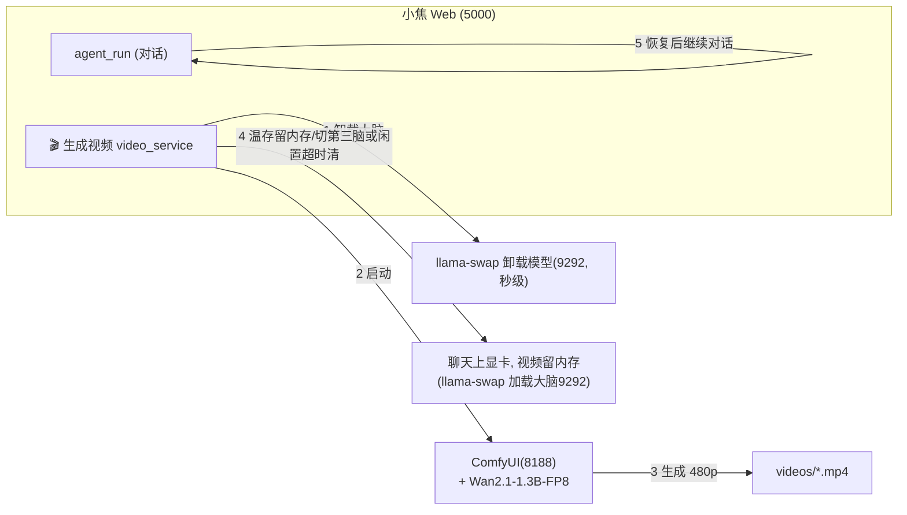
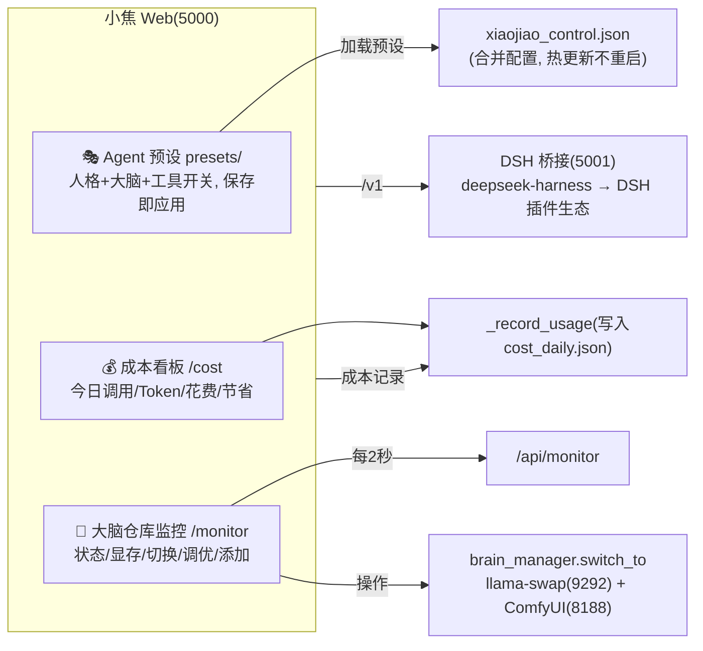
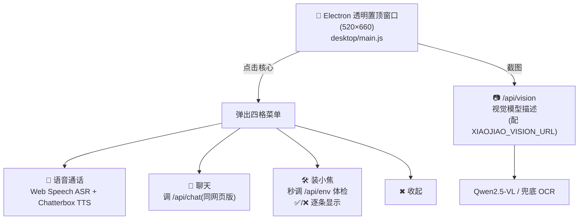

# 架构与设计 · Architecture

> 本文档深入剖析「小焦」的技术选型、模块划分与关键设计决策。

---

## 1. 系统定位

「小焦」不是要复刻一个大模型，而是要回答一个问题：

> **如何用一台消费级设备，拥有一个会持续进化的中文对话伙伴？**

答案是——**蒸馏 + 小模型 + 记忆/插件**。系统把“大脑”拆成两层：

| 层 | 角色 | 负责 |
| --- | --- | --- |
| **大模型（老师）** | 本地 LLM（llama.cpp） | 按时生成高质量对话 / QA，充当教师信号 |
| **小模型（学生）** | 字符级 MiniGPT | 离线推理、低成本运行，承载可沉淀的人格与知识 |

“老师”负责“想得深”，“学生”负责“答得快、记得住”。训练数据由老师蒸馏而来，学生的能力随蒸馏不断成长。

---

## 2. 模块划分

```
xiaojiao-harness/
├── 数据层
│   └── convert.py / clean_data.py / validator.py   → 语料清洗
├── 蒸馏层
│   ├── massive_distill.py       → 主题批量蒸馏
│   ├── distill_and_train.py     → 知识库 QA 蒸馏
│   └── auto_distill_loop.py     → 无间循环驱动
├── 训练层
│   └── train_model.py           → 接力训练器
├── 推理层
│   └── xiaojiao_harness.py      → 交互入口 + MiniGPT + 记忆
├── 扩展层
│   └── plugins/                 → memory / search / weather
└── 观测层
    └── web_monitor.py           → Flask 实时看板
```

各层之间通过**文件**作为边界，松耦合、易替换：

| 边界文件 | 生产者 | 消费者 |
| --- | --- | --- |
| `training_data_pool.txt` | convert.py / 蒸馏器 | train_model.py |
| `vocab.pkl` | train_model.py | xiaojiao_harness.py |
| `mini_gpt_model.pth` | train_model.py | xiaojiao_harness.py |
| `xiaojiao_memory.txt` | 记忆插件 / 用户 | xiaojiao_harness.py |

---

## 3. 核心模型：MiniGPT

### 3.1 网络结构

一个**纯 `TransformerDecoder`** 的因果语言模型，即 GPT-1 时代的经典结构，去掉了 encoder 与 cross-attention，专攻自回归生成：

```text
input_ids ──► TokenEmbedding ──┐
                              ├──► X
pos_ids ───► PosEmbedding ────┘
                             │
                        ┌────▼─────┐
                        │  Decoder │ × N   (self-attention, norm_first)
                        └────┬─────┘
                             ▼
                          Linear → vocab logits
```

关键实现点在 [`xiaojiao_harness.py`](../xiaojiao_harness.py) 与 [`train_model.py`](../train_model.py) 中保持一致，二者共用一个 `MiniGPT` 定义。

### 3.2 为什么用「字符级」tokenize

- 中文没有天然词空格，BPE / wordpiece 需要额外的分词器与子词词表。
- 字符级直接用 `char2idx`，词表即“所有出现过的字”，常仅几百到几千个 token。
- 带来两个好处：**embedding 极小**、**推理生成可逐字中文输出**，对中文最友好。
- 代价是序列更长，但配合 `SEQ_LEN=64` 与自回归训练，对陪伴式短对话完全足够。

### 3.3 Pre-Norm（`norm_first=True`）

Transformer 中 LayerNorm 前置（Pre-LN）比后置（Post-LN）更稳定，尤其在小模型 + 较长序列时几乎成为标配。`nn.TransformerDecoderLayer` 直接暴露该选项，无需手写。

---

## 4. 架构自动推断：权重即 Config

一个小模型最怕“config 与权重对不上”。小焦的做法是**让权重自己描述自己**：

| 超参 | 推断来源 |
| --- | --- |
| `vocab_size` | `vocab["vocab_size"]`（词表文件） |
| `embed_size` | `state_dict["embedding.weight"].shape[1]` |
| `num_layers` | 出现过的最大 `layers.N.*` 层索引 `+1` |
| `hidden_size` | `state_dict["layers.0.linear1.weight"].shape[0]` |
| `num_heads` | `(in_proj.shape[0] // 3) // (embed_size // 8)` |

这样一份 `.pth` 即便换了超参也能被正确重建，`load_model()` 无需任何外部 JSON 配置文件，鲁棒且自包含。

---

## 5. 推理与记忆

### 5.1 自回归解码

```python
logits = model(tensor)[0, -1, :] / temperature
probs  = softmax(logits, -1)
next   = multinomial(probs, 1)
```

- `temperature=0.6`：在“聪明”与“发散”之间取平衡。
- 重复终止：若最近 3 个采样 token 完全一致，则提前结束，避免“复读机”。
- 取最近 32 个 token 作为上下文窗口（`input_ids[-32:]`），兼顾记忆与速度。

### 5.2 检索式记忆

`search_memory()` 用**字符集合交集大小**给每条历史记忆打分：

```python
score = len(set(query) & set(memory_line))
```

取最高分的一条拼进 prompt。这是朴素但有效的“相关度”近似：当没有向量检索基础设施时，用**字符集合重合度**做零依赖的相关性检索。

---

## 6. 插件系统

插件遵循统一的**工具描述 + 分发执行**接口：

```python
class XXPlugin:
    def get_tool_descriptions(self):  # 返回 [{name, description, parameters}]
    def execute(self, tool_name, params):  # 按 name 分发并返回结果
```

这种形态与主流 Agent tool-calling 的 schema 一致，便于未来扩展为真正的“可调用工具”。当前内置：

- `memory.py` → `save_memory` / `read_memory`（持久化到 `xiaojiao_memory.txt`）
- `search.py` → `web_search`（打开百度搜索）
- `weather.py` → `get_weather`（wttr.in 天气）

---

## 7. 真·文生视频（video_service，按需切换）

小焦还具备**本地 AI 文生视频**能力：网页点 🎬 → `video_service` **按需切换模型**（8G 显存互斥）：



**关键**：大脑(LLM) 与 视频(扩散) 不同时占显存——`video_service/model_switch.py` 负责：卸大脑→起 ComfyUI→生成→**温存留内存**（聊天上显卡时不杀它）→切第三个大脑或闲置超15分钟才清。前端显示进度条（后端轮询 ComfyUI `/progress`），状态无锁读取、刷新/多标签不丢进度。

> 详见 [video.md](video.md)。

---

## 7c. 8G 显存管理规则（唯一正解）

```
显存(RUN) 只允许 1 个:  聊天4B / 编码8B / 视频Wan  任一时刻最多一个
内存(WARM) 只允许 1 个: 上次用的大脑(切回秒级), 被新的顶掉就彻底卸载
切换 X:  顶掉旧WARM(卸载) -> 当前RUN去WARM(温存) -> X上显存
同时用:  生成前自动卸载另一个llama(内存守卫), 当前大脑独占显存全速
```

- **谁在用谁全速**（独占显存）。
- **上次用的留内存**（切回快）。
- **防止双模型驻留 OOM**（睡觉真卸载）。

## 7b. Agent 预设 · 大脑监控 · DSH 桥接（最新能力）



---

## 7d. 🐳 桌面贾维斯宠物（Electron）

小焦有了**桌面宠物**——Electron 透明置顶窗口，全息核心，点它弹四格菜单：



- **透明置顶**：始终在最上层，不影响鼠标操作。
- **全息核心**：CSS 渐变 + 脉冲动画，点击弹出菜单。
- **语音通话**：按住 🎤 → ASR 识别 → `/api/chat` → TTS 朗读（Chatterbox sr=24000）。
- **装小焦体检**：秒级环境检测（Python/llama/ComfyUI/GPU），✅/❌ 明确显示。
- **视觉识图**：拍照 → `/api/vision` → 视觉模型描述（Qwen2.5-VL 就绪，8G 显卡可用）。

> 详细见 [docs/jarvis-desktop.md](jarvis-desktop.md)。宠物随 `python start_xiaojiao.py` 自动拉起。

- **Agent 预设**：`presets/*.json`（人格+大脑+工具开关），设置页卡片管理，Web 编辑/增删，**保存即应用**（合并配置 + 热更新，不重启）。
- **大脑仓库监控**：`/monitor` 实时看所有大脑状态/显存/内存/任务，直接切换/调优/添加大脑。
- **DSH 桥接**：5001 端口，依赖 `deepseek-harness`（DeepSeekHarness），让 DSH 社区插件可用。

## 8. 观测层：Web 监控

[`web_monitor.py`](../web_monitor.py) 用 Flask 起一个轻量面板，提供：

- `/` —— 渲染看板（知识片段、记忆、训练池、模型、LLM 状态、最近日志）
- `/api/status` —— JSON 状态接口（供前端 `fetch` 轮询，30s 一次）
- `/api/distill` —— 一键触发 `massive_distill.py` 的异步子进程

它让整条“自进化流水线”可被**实时观测与手动干预**。

---

## 8. 设计权衡小结

| 决策 | 取舍 |
| --- | --- |
| 字符级 tokenize | 用更长序列换零依赖中文友好 |
| 纯 Decoder，无 encoder | 为自回归生成而裁剪，极简 |
| 文件作为层间边界 | 模块解耦、可替换，代价是磁盘 I/O |
| 权重推断配置 | 免去 config 同步问题，代价是推导逻辑需维护 |
| 蒸馏自本地 LLM | 免 API 费用、可控，代价是依赖本地算力 |
