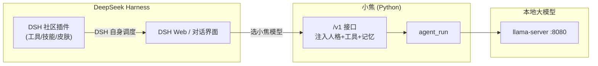

# 用 DeepSeek Harness 接入小焦

小焦暴露一个 **OpenAI 兼容接口**（`/v1`），DeepSeek Harness（DSH）可直接把它当模型接入，从而用上小焦的大脑，并在 DSH 里使用它的社区插件生态。

---

## 原理



- **DSH 是宿主**：它管插件、会话、调度。你告诉 DSH "用 xiaojiao 模型"。
- **小焦当模型**：DSH 把请求发给小焦 `/v1`，小焦注入"我是小焦"人格 + 工具 + 记忆，再交给本地大模型(8080)推理。
- 这样 DSH 的社区插件（工具/技能/皮肤）**在 DSH 里跑、用小焦当大脑**。

---

## 步骤

### 1. 启动小焦
```powershell
cd C:\xiaojiao\xiaojiao harness
python start_xiaojiao.py
```
它会一起启动：本地大模型(8080) + 小焦 Web(5000) + DSH 桥接(5001)。

### 2. 在 DSH 添加模型提供方
DSH → **设置 → 模型** → 添加提供方，填：
| 项 | 值 |
|---|---|
| Base URL | `http://127.0.0.1:5000/v1` |
| API Key | 留空（本地免鉴权） |
| 模型名 | `xiaojiao1.0-4B` |

### 3. 选模型使用
在 DSH 的模型选择器选 `xiaojiao1.0-4B`，就能用小焦当大脑。DSH 的社区插件此时照常在 DSH 里跑，但答题用小焦。

---

## 小焦 /v1 的能力

- `POST /v1/chat/completions` — 对话（OpenAI 兼容，自动带人格+工具）。
- 支持 `tools`（function calling）——小焦的工具/插件可被 DSH 触达。
- 联网搜索 / 记忆 / 会话，都在小焦后端。

> 直接测：`curl http://127.0.0.1:5000/v1/chat/completions -d '{"model":"xiaojiao1.0-4B","messages":[{"role":"user","content":"你是谁"}]}'` → 小焦回答"我是小焦"。

---

## 说明

- **小焦又不想用 DSH**：直接用 `http://127.0.0.1:5000` 网页即可（聊天/联网/记忆/工具/插件生态）。
- **小焦自己的插件**（py/js/api/skill）：`plugins/` 放文件即加载，模型自动用。
- DSH 官方 Python SDK（`deepseek-harness-sdk`）因官方发布不完整暂不可用，但**走 `/v1` 接入 DSH 是通的**。

---

## 常见问题

- **DSH 连上但答"Qwen"？** 请确认选的是小焦 `/v1`（`http://127.0.0.1:5000/v1`），不是裸模型(8080)——只有 `/v1` 才注入"我是小焦"人格。
- **答"大模型未连接"？** 大模型(8080)没起；`start_xiaojiao.py` 会一起起，或单独 `llama-server -m ... -p 8080`。
