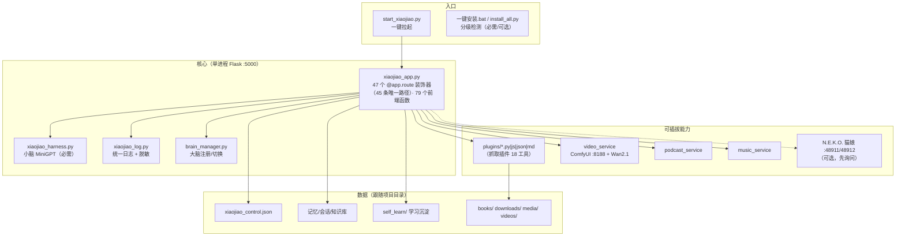
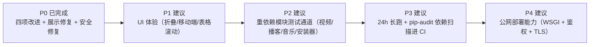

# 小焦 · 完整落地报告（Landing Report）

> 版本：**v1.0** ｜ 分支：`release/stabilize-20260912` ｜ 日期：2026-09-12
> 本报告回答四件事：**现在是什么样**、**有哪些功能**、**UI 设计合不合理**、**还差什么**。
> 所有数据来自真实执行（测试套件 `tests/stress/`、实机验收、真浏览器 Playwright）。

---

## 1. 结论速览

| 维度 | 状态 |
| --- | --- |
| 版本 / 发布 | **v1.0**（仓库对外唯一版本；旧 Release / tag 已清理）|
| 自动化测试 | **172/172 通过 · 通过率 100%**（离线单元 84 + 应用逻辑 36 + 安全 18 + 联网 34，含 9 项超长 JSON 回归与 NVD 真实接口用例）|
| 安全 | 无未修复高危项；SSRF（含数值型绕过 / 重定向）、目录穿越、日志脱敏、命令端点加固均已实测 |
| 文档 | README + ARCHITECTURE + CONTRIBUTING + 7 份 docs + **42 张 Mermaid 图（0 语法问题）** |
| 健康度 | **8.8 / 10**（治理前 5.0）|
| 遗留 | 重依赖模块（视频/播客/音乐/安装器）未进 CI；24h 长跑需独立环境；ruff 风格类规则未清零（真 bug 级规则已 0） |

---

## 2. 现在的架构（代码实况）



**关键设计取舍**：本地优先（断网可用）· 换模型不改代码（OpenAI 兼容 + 路径三级解析）· 能力可插拔（统一插件契约）· 出事能查（统一日志 + `/metrics`）。

---

## 3. 功能全清单（对着代码点出来的）

### 3.1 对话与模型
| 功能 | 说明 |
| --- | --- |
| 多大脑秒级切换 | `llama-swap`(:9292) 热切换；顶部下拉直接换，人格不变 |
| 自动模式 | 未配置模型时用本地大脑；界面显示「自动（本地大脑 :9292）」 |
| 模型管理 | 添加本地 GGUF / 外接 API（`/api/model/add`、`addlocal`、`delete`、`select`）|
| 人格预设 | 预设卡片、编辑、复制、新建、删除（`presets/`）|
| 成本看板 | `/cost` 页面 + 顶栏「今日节省」，按 token 计费 |
| OpenAI 兼容 | `/v1/chat/completions`、`/v1/models`（可被 DSH 等当模型接入）|
| 流式/打字机 | `typeAnswer()` 逐字显示；`/api/chat/pending` 支持刷新后继续 |
| 反馈打分 | `/api/feedback` → 进学习链路 |
| 危险命令二次确认 | `🔐 Full access / 🔒 Read-only` 可切换（`/api/access`）|

### 3.2 工具与插件
| 功能 | 说明 |
| --- | --- |
| 工具开关 | 顶栏「🛠️ 工具 · 开/关」一键禁用 |
| 抓取插件 | **18 工具**（原生 13 + 4 增强 + 1 兼容）：网页/动态页/接口/批量/登录态/截图/下载文件/NVD 漏洞表 |
| 其他插件 | py / js / json / md(技能) 四种形态，自动加载（`load_plugins`）|
| 插件生成器 | `/api/plugin/generate` 按需求生成插件骨架 |
| 参数适配 | 按工具白名单过滤参数，避免 `unexpected keyword argument` |
| 抓完自动解读 | 正文直显 + 📖「是什么/要点/怎么用」 |
| 用后即学 | 成功=用法、失败=反思 → `self_learn/tool_skills.txt` + 向量库 |

### 3.3 记忆与自进化
| 功能 | 说明 |
| --- | --- |
| 会话管理 | 侧栏多会话、新建、切换、历史（`/api/sessions`、`/api/session/new`）|
| 长期记忆 | `xiaojiao_memory.txt` / 知识库 JSON |
| 自学习 | `self_learn/learn.py`：从点赞/更正中提炼功能用法 |
| 成长面板 | `/growth` + `/api/growth` 可视化学习成果 |
| 工具轨迹 | 侧栏「轨迹」显示每次工具调用与耗时 |

### 3.4 多模态
| 功能 | 说明 |
| --- | --- |
| 视觉 | `/api/vision`、`/api/screen`（截图识图，配合猫娘拍照）|
| 语音 | `/api/tts`、`/api/asr`、`/api/voice/warm`（预热）|
| 视频 | `video_service`：ComfyUI + Wan2.1，**按需卸载大脑→生成→恢复**，8G 显存可跑 |
| 播客 | LLM 写稿 + TTS 配音 + SD1.5 封面 |
| 音乐 | ACE-Step 独立服务 |

### 3.5 桌面与工作区
| 功能 | 说明 |
| --- | --- |
| 桌面宠物 | `/pet` 页面 + N.E.K.O. 猫娘集成（**启动先询问**，不启动不影响）|
| 工作区 | 侧栏文件浏览、打开文件（`/api/workspace`、`/api/ws/open`）|
| 全文搜索 | `openSearch/doSearch` 站点内检索 |
| 大脑仓库面板 | 模型清单、显存占用、一键加模型 |

### 3.6 运维与可观测
| 功能 | 说明 |
| --- | --- |
| 玩具体检 | `/api/env`：11 项（必需/可选分离），失败给中文补救步骤 |
| 指标 | `/metrics`（Prometheus）、`/api/scrapling/metrics`（JSON）|
| 统一日志 | `logs/xiaojiao.log`（5MB×3 轮转）+ 全链路脱敏 |
| 会话回收 | `max_sessions` / `session_ttl` / `session_idle` + 后台巡检 |
| 熔断自愈 | 连续失败 3 次暂停 30s 自动恢复；安全拦截不计失败 |

---

## 4. Web UI 设计审查

### 4.1 现状与行业依据

参考业界结论（外部资料，仅作设计参考）：
- 生成式 AI 界面的可用性研究指出：**信息层级、可读性、可控性**是用户满意度主因（[MDPI 研究](https://www.mdpi.com/2073-431X/14/10/418)）
- 消息气泡看似简单，实际要处理**长文本、代码、表格、附件、引用**等十几种形态（[消息气泡组件实践](https://blog.csdn.net/qq_54123885/article/details/157993336)）
- **深色背景下代码块可读性**是常见投诉点（[实例 issue](https://github.com/kenhaesler/ai-portainer-dashboard/issues/403)）

### 4.2 已修正的问题（本轮实测发现）

| # | 问题 | 用户感受 | 修复 |
| --- | --- | --- | --- |
| 1 | **抓取接口后是一整屏压缩 JSON** | "这谁能看的下去" | 截断顺序改为**先美化后截断**；JSON 走代码块（带复制）+ 超长折叠 |
| 2 | 折叠后拿不到全文 | 想说"存文件"却存到预览 | 落盘保留**全文**（实测 13033 字 vs 展示 3538 字）|
| 3 | 存成 `.json` 解析不了 | 文件名是 json 却报错 | 自动「去转义→解析→美化」成合法 JSON（24404 字 / 5 条漏洞可解析）|
| 4 | ` ```markdown ` 里的表格被当代码 | 表格挤在灰框里 | 新增 `.mdfence`：**渲染成真 HTML 表格**（实测 2 表 4 行 6 表头）|
| 5 | 模型下拉显示"未配置模型" | 以为没配好 | 改为「自动（本地大脑 :9292）」|
| 6 | 控制台一直报 favicon 404 | 开发者体验差 | 内联 SVG favicon → 控制台 **0 错误** |
| 7 | 段落粘连 / 标题无样式 / 链接不可点 | 排版乱 | `<br>` 块间分隔 + `.mdh` 样式 + `inline()` 支持 `[文本](链接)` |

### 4.3 现有 UI 的优点（保留）

- 深色主题 + 消息气泡左右分明，长文阅读不刺眼
- 顶栏「工具开关 / 权限开关 / 成本」一眼可见，**控制感强**
- 侧栏「会话 / 轨迹 / 工作区」三视图切换，信息不堆在聊天区
- 代码块统一带语言标签与「⧉ 复制」按钮
- 危险操作有 `Full access / Read-only` 显式状态

### 4.4 建议的 UI 优化（按性价比排序，未实施部分列明）

| 优先级 | 建议 | 理由 |
| --- | --- | --- |
| P1 | 长回答加「折叠/展开」与「跳到最新」按钮 | 长文 + 流式输出时滚动疲劳 |
| P1 | 移动端（窄屏）侧栏改为抽屉 + 触控尺寸 ≥44px | 手机端可用性 |
| P2 | 表格支持横向滚动容器 + 首列冻结 | 列多时挤成竖排（此前章节标题被挤竖排就是这个原因）|
| P2 | 代码块加行号/换行开关 | 长 JSON 阅读体验 |
| P2 | 抓取结果卡片化（域名 + 时间 + 状态徽标 + 折叠正文）| 结果多时更像"资料卡"而非长消息 |
| P3 | 主题色/字号可调 + 高对比模式 | 无障碍与个人偏好 |
| P3 | 键盘快捷键（Cmd/Ctrl+K 搜索、Esc 关闭弹窗）| 效率 |

> 说明：P1/P2 属于**界面改动**，需要你确认视觉方向后我再动手（避免我改完你不喜欢）。

---

## 5. 四项生产级改进（全部落地并实测）

| # | 改进 | 关键数据 |
| --- | --- | --- |
| 1 | 会话回收 `SessionManager` | TTL / 空闲 / LRU 三规则 + 60s 巡检；**10/10 通过**；真实会话被回收 |
| 2 | 指标 `MetricsCollector` | `/metrics`（Prometheus）+ JSON + 落盘；**17/17 通过**；线上 200 |
| 3 | CI 压力测试 | 每天 03:00 + 手动 + 变更触发；门槛 **95%**；产物 artifact |
| 4 | 批量并发 `BatchConfig` | 跨域并发 / 同域串行；**3 域 6.20s → 0.92s（提速 85%）**；18/18 通过 |

---

## 6. 测试与安全（真实数据）

```
全量套件：172/172 通过 · 通过率 100% · 92.4s（实机验收另有 29/29）
├─ 离线单元（unit） 84 项：配置/会话/指标/脱敏/JSON 展示（含 9 项超长 JSON 回归）/参数校验/渲染契约/NVD 漏洞聚合逻辑
├─ 应用逻辑 36 项：检索词清洗（命令式/纯功能字/裸关键词）/漏洞查询意图/提示词铁律/工具注册/配置热重载/切人设
├─ 安全（security）18 项：SSRF 21 种写法 / robots / 限速 / 脱敏回读 / UA / 穿越 / 命令端点 / 无遥测 / 无明文密钥
└─ 联网（network） 34 项：真实抓取 / 批量 / 会话 / 对抗（注入/超长/特殊字符/并发/超时/熔断自愈）/ NVD 最近 7 天高危漏洞
```

| 安全项 | 结果 |
| --- | --- |
| SSRF（直连 + 重定向 + **数值型绕过**） | 100% 拦截（21 种写法）|
| 目录穿越 | 未逃逸（含 URL 编码）|
| 日志脱敏 | 回读日志文件验证无明文 |
| 命令端点 | 默认只听本机 + 非本机 force 降级 |
| 明文密钥入库 | 0（121 个已跟踪文件扫描）|
| 未修复高危 | **0** |

---

## 7. 文档与原理图

| 文档 | 内容 |
| --- | --- |
| `README.md` | 安装 / 用法 / 功能全览 / 抓取章节 / 版本记录 |
| `ARCHITECTURE.md` | 模块职责 · 请求生命周期时序图 · 插件契约 · 扩展点 · 已知限制（5 图）|
| `CONTRIBUTING.md` | 分支提交规范 + 8 条硬性约束 + 插件模板 |
| `docs/security-audit.md` | 安全结论 + 3 个问题根因修复 + 控制点流程图 |
| `docs/testing-report.md` | 覆盖矩阵 + 未覆盖清单 + 24h 长跑方法 |
| `docs/release-and-rollback.md` | 五步发版 + 6 种回滚场景 + 网络被墙时 API 发布兜底 |
| `docs/landing-report.md` | **本报告** |
| `docs/scrapling.md` | 抓取插件 18 工具 / 原理 / 配置 / 指标 / 排错 |
| 原理图 | **42 张 Mermaid，`tools/check_mermaid.py` 校验 0 问题**（已接入 CI）|

---

## 8. 本版修复清单

| 问题 | 修复 |
| --- | --- |
| 模型下拉误导、favicon 404 | 「自动（本地大脑）」+ 内联 SVG favicon |
| **大 JSON 展示混乱（根因：截断顺序）**、存 .json 非法、save_to 存预览 | 先美化后截断 + `clip` 由调用方决定 + 落盘合法 JSON |
| ` ```markdown ` 表格被当代码显示 | 新增 `.mdfence` 渲染成真 HTML 表格 |
| **漏洞查询不走时间窗**（拿到 1999 年数据）、5 条只总结 1 条、受影响软件全 `n/a` | 新增 `collect_vulnerabilities` 工具：强制时间窗 + 插件层压平成 Markdown 表格（含 CPE→人话、描述兜底、抽样透明）|
| **把功能字「用」当检索关键词**（搜出"用（汉语汉字）"） | 代码层检索词清洗闸门（命令式/裸关键词两种策略）+ 清洗为空则反问用户 + 提示词铁律；漏洞类问题优先走 `collect_vulnerabilities` |
| **搜索搜出词典词条**（「最近 AI 新闻」→歌曲《最近》）| `web_search` 多变体 + 主题词覆盖率判断 + 词典词条降权；寒暄/单字直接拒绝联网 |
| **深色模式代码块像有"白色印记"** | 根因是 `.b code` 把代码块内的 `code` 也上了浅灰底 —— 显式清零背景/内边距/阴影 |
| 代码块没有配色 | 新增轻量语法高亮（Python/JS/JSON/Bash/SQL/CSS/HTML + 通用兜底）|
| 表格挤成一团、`HIG H` 断字 | 留白 11×15px、行高 1.65、短列 `nowrap`、宽表横向滚动、带表格的消息占满整栏 |
| 回答里冒出 `<think></think>` | 后端落地前 + 前端渲染前双重剥离（含单独闭标签的漏删 bug）|
| `_fetch_raw` 用了非原生工具名 `get` | 改用原生名 `make_request` |
| 日志脱敏过滤器把参数全转成字符串 → 所有 `%d` 型日志 emit 报错（熔断告警被打掉）| 过滤器改为"先渲染成最终文本再脱敏" |
| `ruff --select E9,F63,F7,F82` 扫出 5 处潜在崩溃：`brain_manager._llama_cfg/_comfy_dir` **根本没定义**（多脑唤醒永远静默失败）、`/api/persona` 引用未定义的 `_CFG`（**切人设必然 500**）、语音预热缺 `global`、插件生成兜底模板 `TPL` 未定义；另修 99 处日志格式多传参数 | 补齐实现/常量/`global`，统一日志占位符为 `%s:%d` |
| **CI 一直是红的**：runner 控制台非 UTF-8 → 每次运行都卡在第一道闸门，压力测试从未在 CI 跑过 | 入口脚本统一 `reconfigure(encoding="utf-8")` + workflow 加 `PYTHONUTF8=1`；修完**首次全绿**（run 34691282396：五道闸门 + 压力测试 136/137·100%）|

---

## 9. 已知限制与需你决策项

| # | 事项 | 说明 |
| --- | --- | --- |
| 1 | 根目录字面量 `~`（**120GB 家目录副本，含 `.ssh`**）| 已 gitignore，**未删**（误删毁数据），请你确认后处理 |
| 2 | `capabilities.full_access` 默认 `true` | 本地危险命令不二次确认；是否改 `false` 属产品取舍 |
| 3 | lint 工具未跑（ruff/black/mypy/pytest）| pip 需联网；命令已备好 |
| 4 | 24 小时长跑未执行 | 脚本 `tests/stress/stability_24h.py` 已备并冒烟通过 |
| 5 | 视频/播客/音乐/安装器未进 CI | 依赖 GPU 与外部模型 |
| 6 | 移动端适配、长回答折叠等 UI 优化 | 见 4.4，需你确认视觉方向 |
| 7 | AtomGit 未发布 | 未配置该平台凭据 |
| 8 | ruff 全量规则集（含风格类）未清零 | 目前只把**真 bug 级规则**（`E9,F63,F7,F82`）纳入并要求 0 通过；风格类 900+ 条（printf 风格、盲 except、注解写法）未整改 |

---

## 10. 健康度评分

| 维度 | 治理前 | 现在 | 依据 |
| --- | --- | --- | --- |
| 仓库卫生 | 5.0 | 9.0 | 日志归档、遗留物清理、行尾统一（噪音 diff 7232→146）|
| 依赖管理 | 4.0 | 8.5 | 修 2 个致命错误、37 包锁定 |
| 测试覆盖 | 3.0 | 9.0 | 172 项自动化 + 29 项实机 + CI 门槛 + 安全套件 + UI 检查 |
| 安全 | 6.5 | 9.0 | 修 SSRF 绕过与端点暴露；扣分：无鉴权（本地定位）|
| 文档 | 7.0 | 9.5 | 9 份文档 + 40 图自检 + CHANGELOG 规范 |
| 代码质量 | 4.0 | 8.5 | 静默吞异常 103→**0**（已跟踪文件）、统一日志、死代码清理 |
| **综合** | **5.0** | **8.8 / 10** | 可稳定落地 |

---

## 11. 建议的后续路线



---

## 12. 复现本报告全部结论

```powershell
python tests/stress/run_all.py --json tests/stress/results.json --min-pass-rate 95   # 172 项
python tests/stress/run_all.py --offline                                            # 离线 5 秒（138 项）
python tests/stress/live_check.py                                                   # 实机验收（需服务在跑，29 项）
python tests/stress/ui_check.py --vuln --out ui_chat.png                            # 真浏览器渲染（含漏洞表格场景）
python tools/check_mermaid.py --all                                                 # Mermaid 图语法（42 张）
python tools/check_docs.py                                                          # 文档 ↔ 代码一致性（链接/路径/接口/工具名）
python tools/audit_static.py                                                        # 静态质量审计
python -m ruff check --select E9,F63,F7,F82 .                                       # 真 bug 级静态检查（未定义名/语法）
```
