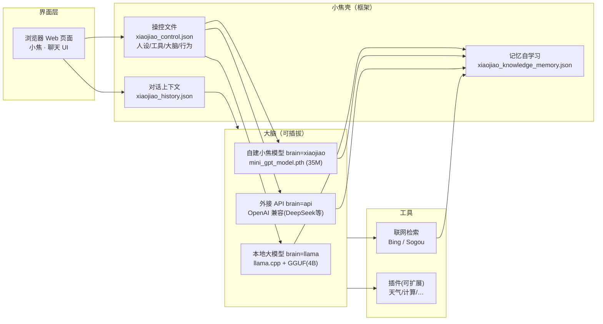

# 小焦 · 模型结构与原理

> 架构核心一句话：**小焦 = 一个可插拔大脑 + 联网 + 记忆 + 上下文的"壳"，壳由操控文件控制。**
> 模型的权重只是底座，人格和工具链是这层壳自己搭的。

---

## 1. 整体结构（一张图看懂）



---

## 2. 组件职责

| 模块 | 职责 | 文件 |
| --- | --- | --- |
| **操控文件** | 定义小焦是什么类型、用哪个大脑、开哪些工具、行为参数。改它=换人格/换能力 | `xiaojiao_control.json` |
| **Web 界面** | 聊天页，显示模型名，发送/接收消息、展示来源 | `xiaojiao_app.py`(HTML) |
| **智能体 Agent** | 编排：上下文 → 记忆 → 联网 → 大脑 → 记忆沉淀 的流程 | `xiaojiao_app.py` (`agent_run`) |
| **大脑** | 生成回答。`auto/llama/xiaojiao/api` 四选一 | 见 `brain` 配置 |
| **联网检索** | 免密钥抓 Bing/Sogou 结果(标题+内容) | `web_search()` |
| **记忆自学习** | 把每次联网学到的知识存成 JSON，相关提问时召回 | `xiaojiao_knowledge_memory.json` |
| **对话上下文** | 保留最近 N 轮，供大脑参考 | `xiaojiao_history.json` |

---

## 3. 大脑（四种模式）

由 `xiaojiao_control.json` 里的 `brain.engine` 决定，可随时切换：

| engine | 大脑 | 说明 |
| --- | --- | --- |
| `llama` | 本地大模型（GGUF 4B） | 用 `llama.cpp` 启动，最强、最能推理，需显存。名字即 `model_name`(=xiaojiao1.0-4B) |
| `api` | 外接 OpenAI 兼容接口 | DeepSeek/OpenAI 等，填 `base_url/api_key/model` |
| `xiaojiao` | 你自建的小焦模型 | 35M 字符模型，离线、轻量、快 |
| `auto` | 自动 | 能连上大模型就用大模型，否则用自建小焦模型 |

> 说明：这里没有把"两个不同架构的模型文件"物理合并成一个文件（不同架构无法合并，否则成废文件）。
> 而是**功能上融合**成一套"小焦 = xiaojiao1.0-4B"：大模型当最强大脑、自建模型当兜底，统一由同一壳/操控文件控制。

---

## 4. 一条消息的处理流程（agent_run）

```
用户输入
  ▼
① 召回相关记忆 (xiaojiao_knowledge_memory.json)
  ▼
② 联网检索 (Bing/Sogou，受 capabilities.web_search 控制)
  ▼
③ 选择大脑 (brain.engine：llama/api/xiaojiao/auto)
  ▼
④ 组装提示词：人设(system) + 历史上下文 + 相关记忆 + 联网资料 + 用户问题
  ▼
⑤ 大脑生成回答（温度/长度由 behavior 控制）
  ▼
⑥ 记忆自学习：把本次学到的关键信息写入记忆
  ▼
⑦ 更新上下文并返回给 Web 页面
```

---

## 5. 你想让它成为什么/加什么，就改操控文件

`xiaojiao_control.json` 是**唯一的控制入口**，改它即可（不用改代码）：

```jsonc
{
  "model_name": "xiaojiao1.0-4B",          // 名字
  "brain": { "engine": "auto", ... },       // 用哪个大脑
  "role": "你是小焦，一个...（写它的类型/性格/规矩）",  // ← 改这里=改变它是哪种模型
  "capabilities": { "web_search": true, "memory": true, "context_len": 20 },  // 开关工具
  "behavior": { "temperature": 0.7, "max_tokens": 1024 }  // 行为
}
```

**加插件**：往 `plugins/` 加一个 .py（含 `XxxPlugin` 类，提供 `get_tool_descriptions` + `execute`）即自动注册。也可在 Web 设置页一键开关。

> **不用改文件也能控制**：Web 页面右上角「⚙️ 设置」里就能换大脑、改人设、调参数、开关插件，保存后立刻生效（内部仍写回 `xiaojiao_control.json`）。

---

## 6. 常用命令

```bash
python start_xiaojiao.py     # ★ 一键：自动启动大模型大脑 + 小焦 Web + 自动开浏览器
python xiaojiao_app.py       # 仅启动 Web（不含大模型，用自建模型兜底）
python train_model.py        # 训练自建小焦模型
python convert.py            # LCCC 语料 → 训练池
```
