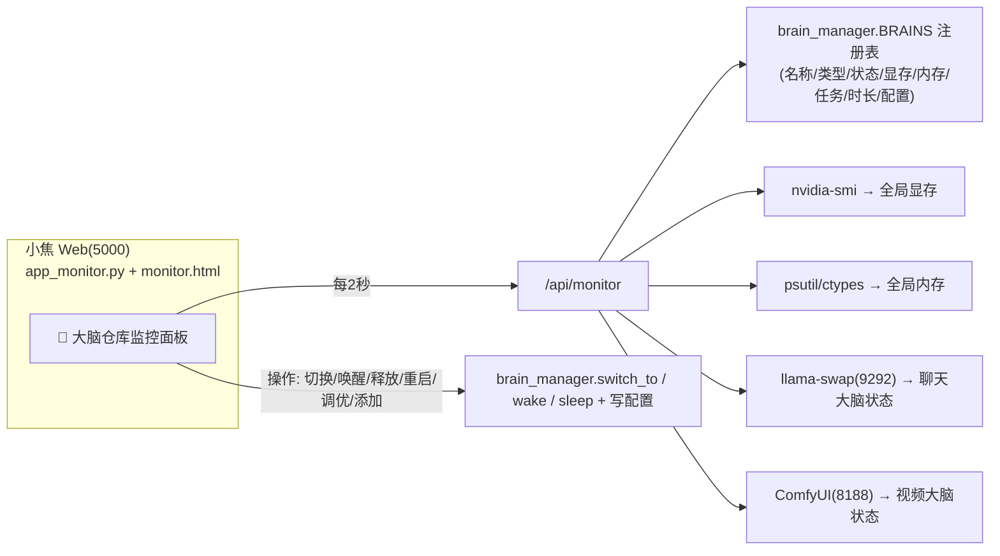

# 🧠 大脑仓库监控面板（小焦 · 介绍）

小焦是**多大脑**架构（聊天 / 视频 / 未来图像·推理）。"大脑仓库监控面板"让你在一个网页里**实时看到所有大脑的状态、显存、内存，并能直接切换/调优/添加大脑**——不用写代码。

## 原理图

## 核心功能
| 类别 | 功能 |
|---|---|
| **展示** | 每个大脑：名称/类型/端口/状态(运行中·温存·空闲)/显存/内存/当前任务/是否挂内存 |
| **全局概览** | 显存使用率、内存使用率、总脑数、在线脑数、温存脑数 |
| **操作** | 手动切换、唤醒、释放、重启、一键清理温存、紧急清空显存 |
| **调优** | 每脑卡片直接开关 `keep_warm`、拖 `卸载优先级`、开关 `挂载内存`（免写码，存到配置） |
| **添加** | 点「＋添加大脑」→ 填**本地模型文件路径** + 名称 + 类型 + 端口 → 添加并加载 |
| **监控** | 最近 60 秒 显存/内存 趋势图(带坐标轴/图例)、操作日志 |

## 数据源
- **显存**：`nvidia-smi`（全局 + 每脑估计）。
- **内存**：`psutil`，无则 `ctypes GlobalMemoryStatusEx`（Windows 兜底）。
- **聊天大脑**：`llama-swap:9292/api/models`。
- **视频大脑**：`ComfyUI:8188/queue`（运行/空闲）。
- **切换/调度**：`brain_manager.switch_to / wake / sleep`。

## 与 llama-swap / ComfyUI 对接
| 大脑 | 对接 |
|---|---|
| 聊天大脑(LLM) | `GET llama-swap:9292/api/models` 读状态；释放→`POST /api/models/unload/xiaojiao` |
| 视频大脑(ComfyUI) | `GET ComfyUI:8188/queue` 读状态；重启/切换走 `brain_manager.switch_to` |

## 打开
`http://127.0.0.1:5000/monitor`（已集成到 5000 服务，顶部有「🧠 监控」入口）。

## 技术
- 后端：`app_monitor.py`（Flask 蓝图）：`/monitor`(页面)、`/api/monitor`(数据)、`/api/monitor/op`(操作/调优/添加)。
- 前端：`monitor.html`（深色，风格参考 DSH，每 2 秒刷新）。
