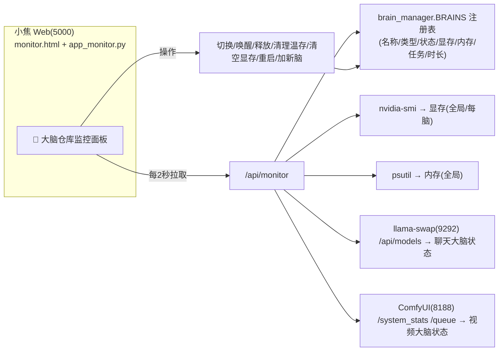

# 🧠 大脑仓库监控面板（原理）

小焦是**多大脑**架构（聊天/视频/未来图像·推理），需要一个**监控面板**实时看着所有大脑的状态、显存、内存、操作切换。

## 原理 / 面板能力
- **大脑清单**：每个大脑显示 名称/类型/状态(运行中·温存·空闲·出错)/显存/内存/当前任务/运行(温存)时长。
- **全局概览**：显存使用率、内存使用率、总大脑数、在线大脑数、温存大脑数。
- **操作**：手动切换大脑、唤醒/释放指定大脑、一键清理所有温存模型、紧急清空显存、重启大脑。
- **监控**：最近60秒显存/内存趋势图、操作日志、每大脑配置参数（keep_warm/卸载优先级）、添加新大脑。
- **数据源**：`nvidia-smi` 读显存、`psutil` 读内存、`llama-swap`/`ComfyUI` 读各大脑状态、`brain_manager` 统管切换。
- **刷新**：每 2 秒；深色主题，风格参考 DSH。

## 与 llama-swap / ComfyUI 对接
| 大脑 | 对接方式 |
|---|---|
| 聊天大脑(LLM) | `GET llama-swap:9292/api/models` → 状态(loaded/unloaded)；`POST /api/models/unload/xiaojiao` 释放 |
| 视频大脑(ComfyUI) | `GET ComfyUI:8188/system_stats` + `/queue` → 运行/空闲；重启走 `brain_manager.switch_to` |
| 全局切换 | `brain_manager.switch_to(脑) / wake / sleep` |

## 查看面板
网页打开 `http://127.0.0.1:5000/monitor`（已集成到 5000 服务）。
