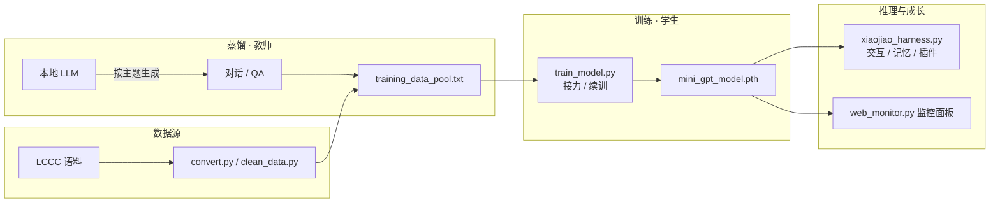

# 全流程 · Pipeline

> 从原始语料到可交互的“小焦”，数据如何一步步流动、又如何在每一步被清洗与强化。

---

## 0. 流程总览



---

## 1. 数据源 → 训练池

原始 LCCC（Large-scale Chinese Conversation Corpus）是**列表数组**，每项是一个对话（list of turns）。`convert.py` 遍历每个对话，把**成对的“用户 / 助手”**抽出，落成统一行格式：

```text
用户 <用户说的话> 小焦 <小焦的回答>
```

- 兼顾两种结构：`list`（逐轮回合）与 `dict`（`user/assistant` 键名），提高容错。
- `clean_data.py` 用正则 `^用户 .+ 小焦 .+` 过滤掉不合规行。
- `validator.py` 守护进程以宽松规则（含“用户”或长度>15）实时剔除乱码与空行，并处理编码损坏。

> ✅ 输出：`training_data_pool.txt`

---

## 2. 蒸馏（教师生成新数据）

### 2.1 主题批量蒸馏 `massive_distill.py`

驱动本地 LLM（llama.cpp `/completion`）按 **40+ 种子主题**（日常聊天、Python、角色扮演、剧情…）逐一生成 3–5 轮自然对话，并解析为合规行追加进训练池。

- 每 10 轮蒸馏后自动 `train_model()`，实现“边蒸边训”的增量成长。
- 断点可续：`Ctrl+C` 中断后重启自动从当前主题继续。

### 2.2 知识库蒸馏 `distill_and_train.py`

读取 `xiaojiao_knowledge.txt` / `xiaojiao_memory.txt` 的长文片段，让教师生成 **5 组 QA**，并**用括号配平法**提取最后一个完整 JSON 数组：

```python
while True:
    start = content.find('[', start)      # 定位数组起点
    ... 逐字符统计深度，配平到 depth==0 的 ']' 记为 end ...
    qa_list = json.loads(content[start:end])
```

之后把 QA 写入训练池并增量训练。这套解析在同一条 prompt 中嵌入多条输出的场景下仍能稳定收割结果。

### 2.3 无间循环 `auto_distill_loop.py`

蒸馏完成 → 等 5 秒 → 立即下一轮，模拟“持续学习”。带 10 分钟超时保护与异常自愈。

---

## 3. 训练（学生自训练）

`train_model.py` 是核心训练器，重点在**接力（resume）**与**稳定性**：

1. **建词表**：从训练池读取字符集，写 `vocab.pkl`。
2. **建模型**：`MiniGPT`（`embed=1024, heads=16, hidden=4096, layers=16`）。
3. **恢复**：优先从 G 盘备份 `mini_gpt_model_backup.pth` 断点续训。
4. **训练**：
   - `LazyTextDataset` 惰性分块 + 步长 `seq_len//2` 采样，避免吃满内存。
   - `torch.amp` 混合精度 + `ACCUMULATION_STEPS` 梯度累积。
   - `Loss=nan` 自动跳过该批，防崩溃。
5. **落盘与备份**：每批存 `.pth` 并 `shutil.copy2` 到 G 盘。

> 生产级配置下，模型参数规模约在 **亿级以内**，可在消费级 GPU 上训练。

---

## 4. 推理与成长

`xiaojiao_harness.py` 完成“最后一公里”：

- `think(user_input)` 组装 prompt：**用户输入 + 历史对话 + 检索记忆**，再交给 `generate_with_model()`。
- 字符级自回归生成，配 `temperature` 与重复终止。
- 记忆、历史在对话中自动累积，形成“长期人格”。

---

## 5. 闭环：全部脚本的启动顺序（推荐）

```bash
# 1) 一次性数据准备
python convert.py && python clean_data.py

# 2) 首次训练
python train_model.py

# 3) 开启自我进化：蒸馏 + 持续训练 + 看板
python massive_distill.py          # 终端 A
python web_monitor.py              # 终端 B → http://127.0.0.1:5000

# 4) 陪它聊天
python xiaojiao_harness.py
```

> 也可以从 `web_monitor` 面板一键触发蒸馏，形成“人机协同的观察-学习循环”。

---

## 6. 数据契约（各阶段约定）

| 文件 | 阶段 | 格式 |
| --- | --- | --- |
| `LCCC-*.json` | 数据源 | 嵌套 list / dict |
| `training_data_pool.txt` | 中间态 | 每行 `用户 X 小焦 Y` |
| `vocab.pkl` | 训练产物 | `{char2idx, idx2char, vocab_size}` |
| `mini_gpt_model.pth` | 训练产物 | `state_dict` |
| `xiaojiao_memory.txt` | 记忆 | 每行 `时间戳 - 内容` |
| `massive_distill.log` | 日志 | 时间戳前缀行 |

---

## 7. 可扩展方向

- 用 BPE / sentencepiece 替换字符级 tokenize，降低序列长度。
- 用向量检索（FAISS / embedding）替换“字符集合交集”记忆检索。
- 引入 RLHF / 反馈（`feedback_log.json` 已有雏形）做偏好优化。
- 蒸馏目标从“对话”升级到“思维链 / 工具调用”，让“小焦”学会使用工具。
