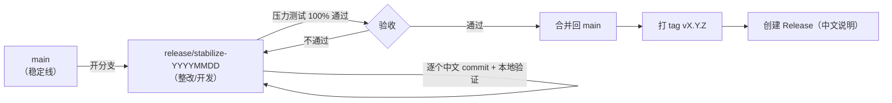

# 发布与回滚预案（Release & Rollback Playbook）

> 面向"接手这个仓库的人"（包括未来的我）：怎么发版、怎么回滚、网络被墙怎么办。
> 原则：**任何一步都能回退**；**绝不 force push 覆盖历史**；**发布前必须跑通压力测试**。

---

## 1. 分支模型



| 分支 | 用途 | 规则 |
| --- | --- | --- |
| `main` | 稳定线，随 Release 走 | 不直接提交；只接受已验证的合并 |
| `release/stabilize-YYYYMMDD` | 整改/开发线 | 一个修复一个 commit，中文 message |

---

## 2. 发版流程（五步）

```powershell
# ① 全量验证（必须 100% 通过，CI 门槛同为 95%）
python tests/stress/run_all.py --json tests/stress/results.json --min-pass-rate 95

# ② 合并到 main（在整改分支上先确认干净）
git status                                  # 应为 clean（个人运行态文件除外）
git checkout main
git merge --no-ff release/stabilize-YYYYMMDD -m "chore(release): 合并 vX.Y.Z 整改分支"

# ③ 打 tag（语义化版本，禁止回退版本号）
git tag -a vX.Y.Z -m "小焦 vX.Y.Z · 一句话说明"
git push origin main
git push origin vX.Y.Z

# ④ 创建 Release（中文说明：新增/修复/变更/升级说明/已知问题/免责声明）
#    无 gh CLI 时用 REST API（见 README 里的示例脚本），或网页手动创建

# ⑤ 发布后回填文档：CHANGELOG（Keep a Changelog 格式）、README 版本表
```

---

## 3. 回滚预案（按"影响面从小到大"）

| 场景 | 操作 | 说明 |
| --- | --- | --- |
| 单个提交有问题 | `git revert <sha>` | **首选**：保留历史，生成反向提交，最安全 |
| 最近几个提交有问题 | `git revert --no-commit <sha1>^..<shaN>` 然后一次提交 | 批量回退且留痕 |
| 整改分支整体退回 | `git checkout main`（不动整改分支） | 不影响 main，等于放弃该分支 |
| 已合并进 main 需回退 | `git revert -m 1 <merge-sha>` | 撤销合并，历史保留 |
| 已发 Release 需撤回 | GitHub Release 界面删除 / 标记为 pre-release，并**新发一个补丁版本** | 不要删除 tag 重发同名版本（会造成用户端混乱） |
| 本地改乱了 | `git restore <file>` / `git reset --hard HEAD`（**未提交**改动才会丢） | 有未提交改动时先 `git stash` |

```powershell
# 回滚示例：撤销"改进 2"那一次提交（保留历史）
git revert 555e3b0
git push origin main
```

> ⚠️ 禁止事项：`git push --force` 覆盖 `main`、删除远端 tag 后重发同名版本、`git reset --hard` 后再 `push -f`。

---

## 4. 网络受限时怎么发布（git 被墙，API 仍通）

现象：`git push` / `git fetch` 报
`fatal: unable to access 'https://github.com/...': Recv failure: Connection was reset`，
但 `https://api.github.com` 正常（本项目实测过多次）。

兜底：用仓库自带脚本，通过 REST API 把本地提交**原样**发布到远端分支：

```powershell
python tools/publish_via_api.py --dry-run          # 先看要发布哪些提交
python tools/publish_via_api.py                    # 真正发布（blob → tree → commit → ref）
```

- 脚本会校验发布后**远端 tree 与本地 tree 是否一致**（内容一致才算成功）
- **注意**：API 发布的提交对象由远端生成，**SHA 可能与本地不同**（提交对象的 committer 元数据差异），
  但**文件内容完全一致**。网络恢复后对齐一次引用即可：

```powershell
git fetch origin
git reset --hard origin/<branch>      # 内容一致，安全；此后本地/远端 SHA 恢复一致
```

- 无法直连 API 时：`git format-patch` 导出补丁 + 手工在网页上传，或等网络恢复后重试。

---

## 5. 发布检查清单

- [ ] `tests/stress/run_all.py` 通过率达标（本地 100% / CI ≥95%）
- [ ] `CHANGELOG.md` 已按 Keep a Changelog 更新（Added / Changed / Fixed / 已知问题）
- [ ] README、`docs/*.md`、原理图与代码一致（配置项、工具数量、命令）
- [ ] 版本号遵循 SemVer（修复 = PATCH，兼容新增 = MINOR，破坏性 = MAJOR）
- [ ] Release 说明含：升级步骤、破坏性变更、已知问题、免责声明
- [ ] 没有把密钥/个人路径/个人运行态文件带进提交（`git diff --cached` 自查）
