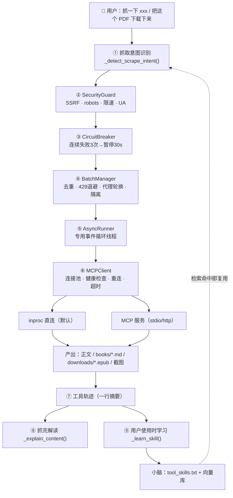
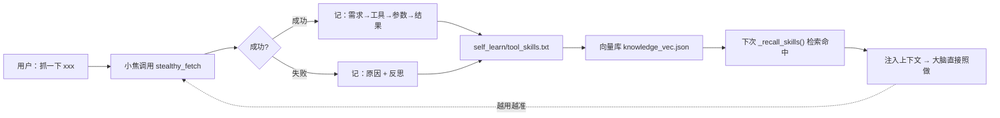

# 🕷️ 内置 Scrapling · 想抓啥抓啥

> 小焦**内置了 Scrapling**（业界最强开源抓取库之一），所以天生会「上网抓东西」：抓网页 / 动态页 / 接口 JSON / 批量列表 / 绕反爬 / 登录态抓取 / **下载任意文件（PDF/EPUB/TXT/ZIP/图片/音视频…）**，
> 抓完**自动解读**、可直接**存成本地文件**，并且**每次使用都会让小脑更会用**。

插件文件：`plugins/scrapling_bridge.py`　｜　依赖：`scrapling[fetchers]` `markdownify`（`mcp` 仅 MCP 模式）

---

## 1. 快速开始

```powershell
# ① 装依赖（国内镜像）
python -m pip install "scrapling[fetchers]" markdownify mcp -i https://pypi.tuna.tsinghua.edu.cn/simple

# ② 浏览器渲染用的 Chromium：自备 Chrome 就填路径，或用官方安装
scrapling install

# ③ 启动小焦（插件自动加载）
python start_xiaojiao.py

# ④ 验证：浏览器打开小焦 → 设置 → 🧩 插件 → 应看到 scrapling_bridge 及其 9 个工具
```

在 `xiaojiao_control.json` 里按需配置（见第 5 节）：

```json
"scrapling": {
  "mode": "auto",
  "executable_path": "D:\\tools\\chrome-win64\\chrome.exe",
  "rate_limit": 1.0,
  "timeout": 60
}
```

---

## 2. 九个工具（覆盖 Scrapling 全部能力）

| 工具 | 参数 | 说明 | 对应 Scrapling MCP |
| --- | --- | --- | --- |
| `get` | `url` `stealth?` `timeout?` `save_to?` | 普通 HTTP 抓取，最快 | make_request |
| `bulk_get` | `urls` `stealth?` | 批量抓（去重/限速/退避/隔离）| bulk_get |
| `fetch` | `url` `wait_selector?` `timeout?` `save_to?` | Playwright 浏览器渲染 | fetch |
| `bulk_fetch` | `urls` | 批量渲染 | bulk_fetch |
| `stealthy_fetch` | `url` `timeout?` `save_to?` | 隐身（指纹随机化 + 过 Cloudflare）| stealthy_fetch |
| `bulk_stealthy_fetch` | `urls`（≤20）| 批量隐身 | bulk_stealthy_fetch |
| `scrape_with_selector` | `url` `selector` `adaptive?` `name?` | 选择器抓取，自适应防改版 | make_request/fetch + `css_selector` |
| `browser_session` | `action` `url?` `session_id?` `session_type?` `full_page?` | 会话管理 / 登录态抓取 / 截图 | open_session、open_request_session、close_session、list_sessions、session_fetch、session_make_request、screenshot |
| 🆕 `download` | `url` `filename?` | **下载文件**（PDF/EPUB/TXT/ZIP）| —（插件自研）|

### 返回值统一结构

```json
{ "status": 200, "url": "https://…", "content": "Markdown 正文", "error": "" }
```

批量工具额外带 `items`：

```json
{ "status": 200, "content": "批量抓取完成：成功 3 / 共 4（去重+安全过滤后实际请求 3）",
  "items": [ { "status": 200, "url": "…", "content": "…", "error": "" }, … ] }
```

### `browser_session` 的 7 种 action

| action | 作用 | 关键参数 |
| --- | --- | --- |
| `open` | 开浏览器会话（dynamic / stealthy），后续复用省去反复起浏览器 | `session_type` |
| `open_http` | 开 HTTP 会话（static），保持 cookie/连接 | — |
| `close` | 关闭会话，释放资源 | `session_id` |
| `list` | 列出当前所有会话 | — |
| `fetch` | **用会话抓页面**（保持登录态 / 已过验证的浏览器）| `url` `session_id` |
| `request` | 用 HTTP 会话发请求（保持 cookie）| `url` `session_id` |
| `screenshot` | 给页面截图（可整页），图片存 `media/screenshot/` | `url` `session_id` `full_page` |

> 典型流程：`open(stealthy)` → `fetch` 多次（同一浏览器、已过验证）→ `close`。

---

## 3. 用法示例

| 你想干的 | 对小焦说 | 结果 |
| --- | --- | --- |
| 抓普通页 | 抓一下 example.com | 正文 + 📖 解读 |
| 批量抓 | 抓取 https://a.com 和 https://b.com | 逐项结果（自动去重）|
| 抓动态页 | 用浏览器渲染抓 https://… | 渲染后正文 |
| 绕反爬 | 用 stealthy_fetch 抓 https://… | 隐身抓取 |
| **存成文件** | 抓这章存成 ch1.md | `books/ch1.md` |
| **下载任意文件** | 把这个 PDF / ZIP 下载下来 https://… | `downloads/book.pdf`（PDF/EPUB/TXT/ZIP/图片/音视频都能下）|
| 抓接口 JSON | 抓 https://…/api/list（返回 JSON）| 原样返回 JSON 文本 |
| 登录态抓取 | 开个会话，然后抓 https://…（需要登录的页）| 会话内抓取 |
| 整页截图 | 给 https://… 截个整页图 | `media/screenshot/*.png` |

### 抓完的自动解读

```
🌐 https://example.com · HTTP 200

# Example Domain
This domain is for use in documentation examples without needing permission…

──────────────
📖 小焦解读
这是一个用于文档示例的占位域名页面，本身不提供实际功能。
· 它仅用于演示和文档说明，不具备任何真实服务或数据。
· 域名由 IANA 专门保留，用于技术文档、教程和示例代码中。
· 页面中唯一的可点击链接指向 IANA 官网…
```

解读按固定结构生成：**一句话说明是什么 → 3~6 条要点 → 怎么用**；强调"只依据抓到的内容、不编造"。
若模型不可用或输出过短 → 自动退回**规则提纲**（抽标题 / 链接 / 段落首句），保证总有结构可看。

---

## 4. 原理

### 4.1 整体架构与数据流



### 4.2 抓取意图直通（为什么不让模型自己选工具）

4B 级模型 function calling 不稳：让它"自己决定用什么工具"，常见结果是**编造一段代码**而不是真去抓。
所以小焦用**规则识别**兜底：

- 动词词表：抓取 / 爬取 / 抓一下 / 爬一下 / 下载 / 浏览器渲染 / 隐身 / stealthy / Cloudflare…
- 网址提取：`https?://…` 或裸域名（`example.com` 自动补 `https://`）
- 命中即**直接构造工具调用**并执行，**说到就做到**；多个网址自动升级为批量工具。

### 4.3 正文直显（不许"总结"吃掉内容）

抓到的正文若交给小模型"总结成一句话"，用户就只能看到"已获取内容"。
因此抓取结果**原样展示**（单页限 4000 字、批量每项 1500 字），**再附**解读。

### 4.4 异步桥接（最易翻车的地方）

| 问题 | 做法 |
| --- | --- |
| Flask 是同步线程，Scrapling 是异步 API | 起一条**常驻事件循环线程**（`AsyncRunner`），协程提交进去执行 |
| 反复 `asyncio.run()` 会不断建/销毁循环 → 冲突 | **禁止**直接用 `asyncio.run()`；统一走 `run_coroutine_threadsafe` |
| 调用可能挂死 | `future.result(timeout=…)`，超时 → `future.cancel()` + 中文超时错误 |
| MCP 服务崩溃 | 调用前健康检查（进程存活/连接有效），失效即重连（30 秒窗口内恢复）|

### 4.5 双通道

| 通道 | 何时用 | 优点 | 缺点 |
| --- | --- | --- | --- |
| **inproc**（默认）| `mode=auto`/`inproc` | 错误信息**完整**（能拿到真实异常）、无子进程、延迟低 | 与宿主同进程 |
| **mcp** | `mode=mcp` | 进程隔离、可接远程 HTTP MCP | 出错只回一句 `Error executing tool xxx`，难排查 |

`auto` 刻意设计为 **inproc 优先**：4B 场景最需要"错误可读"。MCP 的笼统错误也在插件里做了中文化与排查建议（如提示缺 `markdownify`）。

### 4.6 批量策略

URL 去重 → 逐条限速（≥1s/域）→ 遇 429 指数退避（1→2→4→8s，最多 3 次）→ 代理轮换（单代理 ≤5 次，用满重置）→ **单个失败只标记该项**，不影响其余。
批量内部**逐 URL 调"单个"工具**（而非一次性并发调 `bulk_*`），这样才能真正控制限速/退避/隔离。

### 4.7 熔断自愈

同一工具连续失败 `circuit_breaker_threshold`（默认 3）次 → 暂停 `circuit_breaker_timeout`（默认 30s），期间返回「工具暂时不可用，请 30 秒后重试」→ 到期**自动恢复**（半开）。
**安全拦截（SSRF / robots / 参数缺失）不计入失败** —— 那是按策略正常拒绝，不是工具故障。

### 4.8 自适应选择器

- 保存指纹：`标签 / class 集合 / id / 文本 / 父节点路径 / 兄弟位置 / 属性集合`
- 恢复：加权相似度（text 0.25、classes 0.25、tag 0.15、id 0.15、path 0.10、sibling 0.10）
- 多个 >90% 相似候选 → **全部返回 + 置信度**，不擅自只取第一个
- 目标元素被删 → 结构化 `{"status":"not_found","error":"元素不存在"}`，**绝不返回错误元素**

### 4.9 内容标准化与安全

- 统一 `{status,url,content,error}`；HTML → Markdown；**Setext 标题 → ATX**（`标题\n====` → `# 标题`，否则前端渲染不出标题）
- JSON 超长截断（10000 字符）；错误**一律中文可读**，绝不输出 Python 堆栈
- 日志脱敏：`Authorization / api_key / token / cookie / bearer` 一律 `***`
- 结果只写本地（`books/`、`downloads/`、`media/screenshot/`），**不上传任何第三方**

---

## 5. 配置项

| 字段 | 默认 | 说明 |
| --- | --- | --- |
| `mode` | `auto` | `auto`（进程内优先）/ `mcp`（强制 MCP）/ `inproc` |
| `scrapling_mcp_url` | `""` | http 模式地址，如 `http://127.0.0.1:8000/mcp` |
| `mcp_command` | `scrapling` | stdio 模式可执行命令 |
| `executable_path` | 自动探测 | 自备 Chrome/Chromium 路径（如 `D:\tools\chrome-win64\chrome.exe`；留空即自动探测或用内置 Chromium）|
| `proxy_list` | `[]` | 代理池，逐条轮换 |
| `rate_limit` | `1.0` | 同域最小请求间隔（秒）|
| `timeout` | `60` | 单次调用超时（秒）；浏览器类工具内部自动换算成毫秒 |
| `max_retries` | `2` | 普通失败重试次数 |
| `circuit_breaker_threshold` | `3` | 连续失败几次触发熔断 |
| `circuit_breaker_timeout` | `30` | 熔断后多久自动恢复（秒）|
| `solve_cloudflare` | `true` | 隐身模式尝试自动过 Cloudflare 验证 |
| `headless` | `true` | 浏览器是否无头 |

环境变量覆盖：`XIAOJIAO_SCRAPLING_MODE` / `_MCP_URL` / `_CHROME` / `_TIMEOUT` / `_RATE`

---

## 6. 用户使用时学习（越用越会）

**不是**从插件代码学，而是**用户每次让它干活时**沉淀经验：



自动反思规则示例：

| 失败原因 | 自动记下的"下次怎么改" |
| --- | --- |
| robots.txt 禁止 | 提示用户换站点或说明原因 |
| SSRF 拦截 | 内网/本机地址属安全拦截，直接告知用户 |
| 超时 | 加大 timeout 或改用更轻的 `get` |
| 缺 markdownify | `pip install markdownify` |
| MCP 未运行 | 先启动 Scrapling |
| 会话未开 | 先 `browser_session action=open` |

---

## 7. 测试与验收清单

```powershell
cd xiaojiao-harness
# 依赖
python -m pip install "scrapling[fetchers]" markdownify mcp -i https://pypi.tuna.tsinghua.edu.cn/simple
# 启动
python start_xiaojiao.py
```

| # | 测什么 | 期望 |
| --- | --- | --- |
| 1 | 设置 → 🧩 插件 → `scrapling_bridge` | 看到 **9 个工具** |
| 2 | 对小焦说「用 stealthy_fetch 抓一下 example.com」 | 工具轨迹出现 `stealthy_fetch`、正文 + 📖 解读 |
| 3 | 说「抓一下 127.0.0.1」 | 中文提示「禁止访问本机/内网地址（SSRF 防护）」 |
| 4 | 说「抓取 https://a.com 和 https://b.com」 | 批量结果，重复 URL 只抓一次 |
| 5 | 说「抓这章存成 ch1.md」 | `books/ch1.md` 生成 |
| 6 | 说「下载 https://…epub」 | `downloads/*.epub` 生成，返回路径 + 大小 |
| 7 | 说「给 https://… 截个整页图」 | `media/screenshot/*.png` 生成 |
| 8 | 连续用同一抓取 3 次都失败 | 第 4 次提示「工具暂时不可用，请 30 秒后重试」，30s 后自动恢复 |
| 9 | 查 `self_learn/tool_skills.txt` | 每次使用都新增一条（成功记用法 / 失败记反思）|
| 10 | 切换 `mode="mcp"` 且不启动 MCP 服务 | 中文提示「Scrapling MCP 未运行，请先执行 scrapling mcp」，无堆栈 |

---

## 8. 排错

| 现象 | 原因 | 解决 |
| --- | --- | --- |
| 插件列表里没有 `scrapling_bridge` | 依赖缺失或模块加载报错（旧版小焦加载器不注册 `sys.modules`，`@dataclass` 会失败）| 更新小焦到本版；确认 `pip install "scrapling[fetchers]"` |
| `Markdown conversion requires the "markdownify"` | 缺 markdownify | `pip install markdownify`（插件已做降级：缺它则用 html + 内置转换）|
| `Error executing tool make_request`（MCP 模式）| MCP 只回笼统错误 | 把 `mode` 改成 `auto`/`inproc`，能拿到真实异常 |
| 目标返回 403/202 空内容 | 站点 WAF 拦 UA / 无头浏览器被识别 | 用 `stealthy_fetch`；或 `browser_session` 开 stealthy 会话后 `fetch` |
| `Unexpected keyword argument` | 参数被自动白名单过滤掉了（不同工具支持的参数不同）| 见第 2 节各工具参数表 |
| 浏览器起不来 | Chromium 未安装 / 路径不对 | 填 `executable_path` 或 `scrapling install` |
| 小焦重启后改动没生效 | 可能有**两个 python 进程同时占用 5000**（旧进程抢答）| `netstat -ano | findstr :5000` → 结束多余进程后重启 |

---

## 9. 边界与合规（重要）

- 🚫 **不绕付费墙、不抓需登录的受限内容、不下载受版权保护的正文**
  （起点、readnovel 等商业小说站：只取公开信息如书籍简介/目录，**章节正文与 VIP 内容不动**）
- 🚫 **不抓内网/本机/保留地址**（`127.0.0.1`、`10.x`、`192.168.x`、`169.254.x`、`file://`、`gopher://`…）
- ✅ 适合：**公版书**（[古腾堡](https://www.gutenberg.org)、[维基文库](https://zh.wikisource.org)、[ctext](https://ctext.org)）、公开文档与论文、新闻与公开数据、你自己的站点/资料
- 📌 抓取前自动检查 `robots.txt`；请在遵守目标站点条款与当地法律的前提下使用

---

> 相关：[README 抓取章节](../README.md#️-内置-scrapling--想抓啥抓啥) · [持续学习](self_learn.md) · [插件指南](PLUGINS.md) · [工具说明](tools.md)
