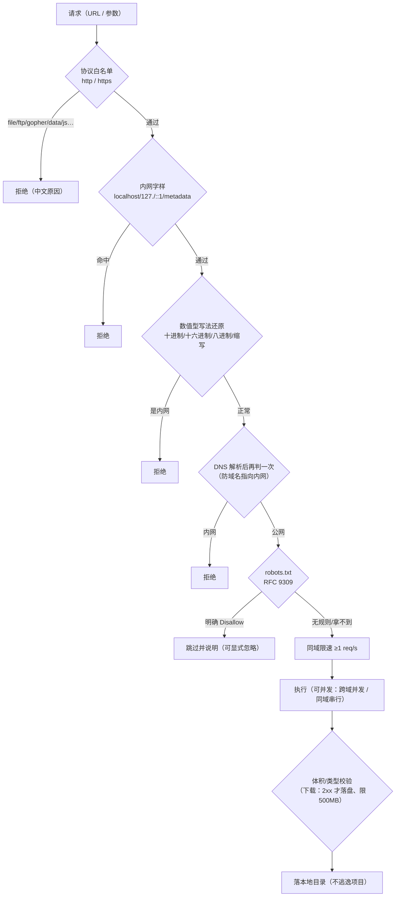

# 安全审计报告（Security Audit）

> 审计对象：小焦（XiaoJiao Harness）本地 AI 助手框架 · 抓取能力与工具执行面
> 审计方式：**真实调用 + 源码审计 + 自动化用例**（`tests/stress/test_security.py`，可随时重跑）
> 最近一次执行：**2024 版全量套件 94/94 通过 · 通过率 100%**

---

## 1. 结论速览

| 领域 | 状态 | 证据 |
| --- | --- | --- |
| SSRF（直连） | ✅ 100% 拦截（21 种写法/目标） | 自动化用例矩阵 |
| SSRF（重定向） | ✅ 拦截（公网 302 → `127.0.0.1` 被拒） | 联网用例 |
| SSRF（**数值型绕过**） | ✅ **本轮修复**：`2130706433` / `0x7f000001` / `127.1` / `10.1` / `017700000001` / `192.168.1` | 用例新增 6 种写法 |
| robots.txt 合规 | ✅ 按 RFC 9309：有 `Disallow` 才拦，404/403/5xx 放行 | 用例 3 项 |
| 同域限速 | ✅ 实测间隔 1.00s；不同域互不阻塞（0.00s） | 计时用例 |
| 目录穿越 | ✅ `../../` 与 URL 编码穿越均被净化；未逃逸项目目录 | 用例 2 项 |
| 日志脱敏 | ✅ 裸凭据/键值对全部打码；**回读日志文件验证**无明文 | 用例 2 项 |
| User-Agent 合规 | ✅ 可识别 UA，不伪装搜索引擎/爬虫 | 用例 1 项 |
| 命令执行端点 | ✅ **本轮加固**：默认只监听本机；非本机客户端 force 被降级 | 源码契约用例 3 项 |
| 数据外传 | ✅ 全仓无遥测/上报埋点（grep 0 命中） | 用例 1 项 |
| 明文密钥入库 | ✅ 121 个已跟踪文件扫描 0 命中 | 用例 1 项 |

**当前无未修复的高危问题。**

---

## 2. 本轮发现并修复的问题

### 🔴 S-1：SSRF 数值型写法绕过（高危，已修复）

**发现方式**：新增安全用例时，测试把 `http://2130706433/` 一起喂进去 → **放行了**。

```
漏网：['http://2130706433/']        # 2130706433 就是 127.0.0.1 的十进制写法
```

**根因**：原实现只做两件事 —— ① 前缀匹配 `127.` / `localhost` 等；② `socket.getaddrinfo` 解析后判定。
而 `2130706433` 既不以 `127.` 开头，本机 `getaddrinfo` 也解析不了（走进"解析失败 → 放行"分支），
但 HTTP 客户端（curl/浏览器）会把它当 IPv4 用 —— 等于**直接打本机**。

**修复**（`plugins/scrapling_bridge.py::SecurityGuard._numeric_host_to_ip`）：把各种数值写法先还原成 IP 再判定：

| 写法 | 含义 | 现在的处理 |
| --- | --- | --- |
| `2130706433` | 十进制 | → `127.0.0.1` → 拦截 |
| `0x7f000001` | 十六进制 | → `127.0.0.1` → 拦截 |
| `017700000001` | 八进制 | 按 inet_aton 语义还原 → 拦截 |
| `127.1` / `10.1` / `192.168.1` | 缩写点分 | 补位还原 → 拦截 |

**复测**：6 种绕过写法全部拦截；`https://example.com`、`https://httpbin.org/get` 等正常地址仍放行。

### 🟠 S-2：命令执行服务默认暴露到局域网（中高危，已加固）

**发现方式**：源码审计 `xiaojiao_tools.py`。

**问题**：`/api/run` 能执行**任意 PowerShell 命令**、**无鉴权**，却默认 `app.run(host="0.0.0.0", port=5003)` ——
同一局域网内任何设备都能远程执行命令；且 `force` 默认 `True`（跳过危险命令确认）。

**加固**：
```python
# 默认只监听本机回环；要局域网使用必须显式设置并自担风险
host = os.environ.get("XIAOJIAO_TOOLS_HOST", "127.0.0.1")
# 只有本机客户端才允许 force（跳过确认）
force = bool(data.get("force", True)) and (request.remote_addr in ("127.0.0.1", "::1", "localhost"))
```
并新增 3 条**源码契约用例**（默认监听本机、非本机降级、异常不抛堆栈）防止回归。

> 仍存在的环境层风险（需使用者知情）：`xiaojiao_control.json → capabilities.full_access` 默认为 `true`，
> 表示**在本地主程序里执行危险命令不再二次确认**。这是"本地个人助手"的设计取舍；
> 若要更保守，把它设为 `false`（每次危险命令都会先问）。

### 🟡 S-3：脱敏只认"键值对"形式（中危，已修复，上轮完成）

`sanitize()` 原来只匹配 `api_key=xxx` 这类写法，**裸凭据**（`sk-…`/`ghp_…`/`AKIA…`/`xox…`/JWT）会原样进日志与指标。
已在 `sanitize()` 与 `xiaojiao_log.scrub()` 两处补齐，并用"写日志→回读文件"的方式验证无明文。

---

## 3. 安全设计与控制点



| 控制点 | 实现 | 备注 |
| --- | --- | --- |
| 协议白名单 | `BLOCKED_SCHEMES` | 仅 http/https 放行 |
| SSRF 三重判定 | 前缀 + 数值还原 + DNS | DNS 解析失败**不**当作安全（会走后续请求报错） |
| robots | 自行拉取 + 解析，RFC 9309 | 401/403/404/5xx 视为"无规则"→ 放行 |
| 限速 | 每域时间戳 + 线程锁 | 跨域并发时可配置（默认 3） |
| 文件安全 | 文件名净化 + `abspath` 前缀校验 | 越界即改名并提示 |
| 熔断 | 连续失败 3 次 → 暂停 30s | 安全拦截**不计**失败（避免误熔断） |
| 脱敏 | `xiaojiao_log.scrub()` + 插件 `sanitize()` | 日志过滤器兜底，双保险 |
| 本地化 | 抓取结果只落 `books/` `downloads/` `media/` | 无任何上传代码 |

---

## 4. 复现方式（可自查）

```powershell
# 安全用例（离线，3 秒）
python tests/stress/run_all.py --offline

# 全量（含联网的对抗测试：重定向 SSRF / 注入 / 并发 / 熔断）
python tests/stress/run_all.py --json tests/stress/results.json --min-pass-rate 95
```

单点验证 SSRF 修复：
```powershell
python -c "import sys; sys.path.insert(0,'plugins'); import scrapling_bridge as m; g=m.SecurityGuard(); print([g.check_ssrf(u) for u in ['http://2130706433/','http://0x7f000001/','http://127.1/','https://example.com']])"
```

---

## 5. 边界与免责

- 抓取能力**仅用于公开可访问内容**；不绕付费墙、不破解版权、不抓需登录的受限内容。
- SSRF/robots/限速是**技术兜底**，不代表可以抓不该抓的东西；使用者需自行遵守目标站点条款与当地法律。
- 本项目为**个人本地**助手框架：`xiaojiao_tools.py`(5003) 与 `xiaojiao_app.py`(5000) 均**无鉴权**，
  请勿直接暴露到公网；如需公网使用，请自行加反向代理鉴权与 TLS。

---

## 6. 后续建议（人工决策项）

1. **公网部署**：换 WSGI 服务器（waitress/gunicorn）+ 鉴权 + TLS；目前是 Flask 开发服务器。
2. **`full_access` 默认值**：是否改为 `false`（每次危险命令二次确认）属产品取舍，需你决定。
3. **依赖漏洞扫描**：`pip-audit` 需联网安装（当前 pip 代理不可达），恢复网络后建议纳入 CI。
4. **长跑安全监控**：把 `/metrics` 接入监控，对异常失败率/SSRF 拦截激增告警。
