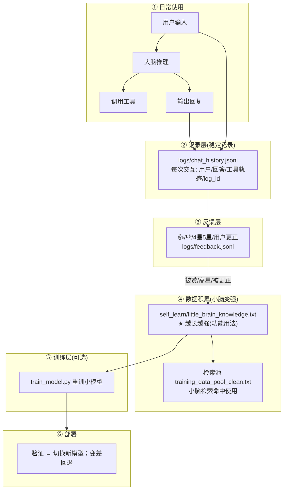

# 小焦 · 持续学习（小脑跟着大脑学）

> **别人靠算力，小脑靠文本。** 小脑不强在算力，强在一本「跟着大脑学来的、越来越厚的**功能用法**」文本文件 + 检索。这就是持续学习（自学习）。

---

## 原理

小焦分两层：**大脑**（本地大模型，强、贵）负责思考、调用工具、给出好答案；**小脑**（自研 MiniGPT + 检索）弱但能学。**持续学习 = 把大脑每次"做得好"的功能套路，记进一个不断增长的文本库，小脑检索可复用**——这样小脑会越来越强，且不靠算力。



**一句话**：大脑做得好 → 被点👍被更正 → 这条"用户要什么 + 大脑怎么用工具解决"被写进**小脑知识库** → 小脑检索命中即可复用 → 小脑越来越强。

---

## 功能

### 内置（无需手动）
- **答完自动记录**：`xiaojiao_app.py` 返回答案时自动把 `用户/回答/工具轨迹/log_id` 写进 `logs/chat_history.jsonl`（每次对话稳定记录）。
- **每条消息自带 👍/👎**：点一下调 `/api/feedback`。
- **点 👍/👎 立刻学习**：被赞/高星/被更正的，**自动**把该条「用户问题 → 最终回答 + 用到的工具」写进 `self_learn/little_brain_knowledge.txt`（小脑知识库）并同步检索池。

### 独立工具（`self_learn/learn.py`）
| 命令 | 作用 |
| --- | --- |
| `python learn.py log <问题> <回答> [工具轨迹]` | 手动记录一次交互 |
| `python learn.py feedback <log_id> good\|5星\|bad [更正]` | 记录反馈 |
| `python learn.py build` | 把"被赞/高星/更正"的高质量交互灌进知识库+检索池 |
| `python learn.py train` | （可选）用积累数据重训小模型 |

---

## 如何判断小脑变强了（可量化）
1. **知识库在长**：`little_brain_knowledge.txt` 行数上升（越强）。
2. **检索命中**：问和学过的相似问题，小脑**直接命中**学过的答案（对得上、不瞎扯）。
3. **对比测试**：一组测试题，学了更多后答对/命中率上升。
4. **重训后**：loss 下降、同题输出更顺。

---


## 小脑的角色（关键）

- **小脑不是"跑插件"的**——插件（py/js/api/skill）是**大脑**在调用；自研 35M 小模型做不了 function-calling。
- 小脑靠**生成 + 检索**回答：`xiaojiao_harness.retrieve_reply` **先用向量库**(`self_learn/vstore.py`，含反思+功能用法)语义检索，命中即复用，否则回退字符集/生成。
- **插件让小脑变强的路径**：大脑用插件做得好 → 被👍/更正 → 学习系统把"用户要什么+大脑怎么用工具"写进**知识库+向量库** → 小脑下次相似问题检索命中。**所以下载插件、用得好 → 小脑"学会怎么答"**（不是"亲手跑"，是"学答案"）。

> 结论：**不需要**让小脑去跑插件；它已经通过持续学习**随插件使用而变强**（知识库+向量检索）。这是"别人靠算力，小脑靠文本+检索"的体现。

## 向量库 + 反思（让小脑越用越强）

**小脑检索升级为向量检索**（`self_learn/vstore.py`，零依赖 Embedding+余弦，对标 Chroma/FAISS）：

- 用户问题 → Embedding → 向量 → 余弦相似度 → 命中即复用，否则才调大脑推理。
- 学过的"功能用法/反思"都向量化进 `knowledge_vec.json`，越学越全。

**反思机制**：用户 👎/更正 → 生成"为什么没答好/下次怎么改"的**反思**（`python learn.py reflect`）→ 存进知识库 + 向量库。下次相似问题就命中这条反思。

## 如何优化（让学习更快更准）
- **反馈要真实**：只给**真的好**的回答点 👍/更正，避免"垃圾进垃圾出"。可只对**用了工具且结果正确**的交互记高质量。
- **加大知识库利用**：`build` 会同步进检索池 `training_data_pool_clean.txt`；**池越大检索越准**（配 `xiaojiao_harness.py` 的语义检索）。
- **定期重训**：知识积累到一定量后 `train_model.py`，让**小模型本身**也吸收——但注意**别覆盖好的旧模型**（备份+验证+回退）。
- **功能优先**：优先学**工具用法**（建文件/查IP/写代码这类），因为小脑变强点在"**功能能力**"，不是啰嗦闲聊。
- **阈值/质控**：可给 `build` 加"今日新增上限 / 只学点赞≥X / 去重"，让知识库不臃肿、质量高。

---

## 目录
```
self_learn/
├── learn.py                  # 持续学习引擎(log/feedback/build/train)
├── README.md                 # 引擎说明
└── little_brain_knowledge.txt  # ★ 小脑知识库：越长越强(由 build/内置反馈自动生成)
```
项目根 `logs/chat_history.jsonl`(记录层) + `logs/feedback.jsonl`(反馈层)。
