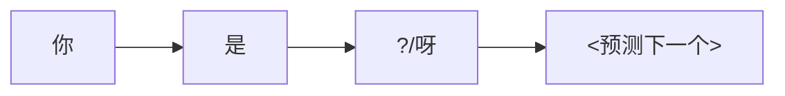
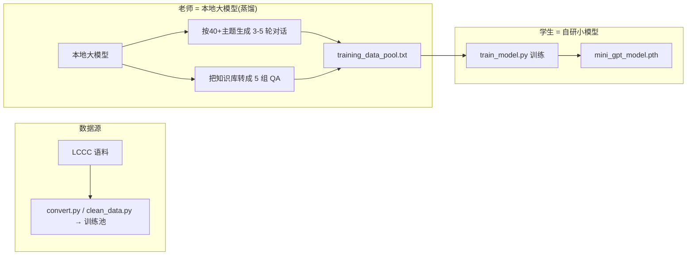
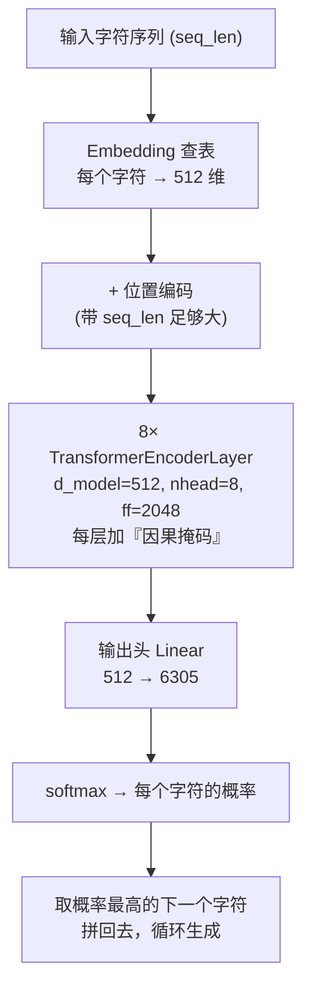
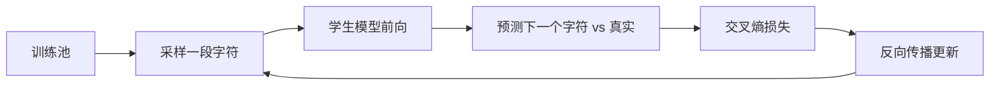
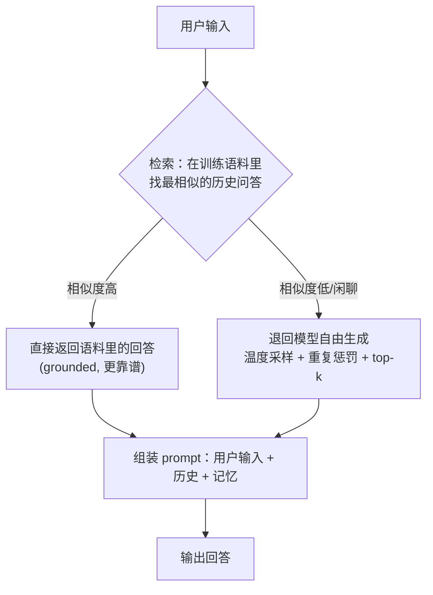

# 自研蒸馏小模型（MiniGPT）：原理 · 架构 · 训练

这一篇专门讲小焦**真正自己造**的那颗模型——一个**字符级的自回归小模型**，靠**知识蒸馏**从大模型那里"学会说话"。它是这个项目的核心和起点。下面是它的完整原理、架构和训练管线。

---

## 0. 一句话

> 用"聪明的老师"（本地大模型）大量生成对话和问答，然后把 **字符一个接一个预测** 这个任务，教给一个**大家自己训练的、很小的 Transformer**。这个小模型就是"老师们知识的浓缩"。

---

## 1. 它负责"下一个字是什么"

它是个**字符级语言模型（Character-Level LM）**：给它一串字符，它预测"下一个字符最可能是谁"。中文句子就是一堆字符，学会"下一个字"就学会了"说话"。

所以它的输入输出都是**字符**（不是词/子词）。词表就是语料里出现过的所有不同字符（`vocab_size=6305`）。

---

## 2. 数据：大模型怎么"教"它

小模型自己没本事"学会"自然对话，所以用**知识蒸馏**：让大模型当老师，生成大量标准对话和问答，灌给小模型当训练数据。

- **主题蒸馏**（`massive_distill.py`）：按 40+ 种子主题让它生成多轮对话，一批批喂给学生。
- **知识蒸馏**（`distill_and_train.py`）：把长文知识切成问答，让老师生成 QA，学生学。
- **无间循环**（`auto_distill_loop.py`）："蒸完→训练→再蒸"不停，模拟持续学习。

---

## 3. 模型架构：MiniGPT

不是那种几十 B 的大 Transformer，而是一个**小而规整**的因果 Transformer。数值从 `model_config.json` 读（训练时存下真实架构，避免猜错）：

| 部件 | 数值 | 作用 |
| --- | --- | --- |
| `vocab_size` | **6305** | 字符词表大小（输出候选数） |
| `embed_size` | **512** | 每个字符变成的向量维度 |
| `num_heads` | **8** | 注意力头数 |
| `hidden_size` | **2048** | 前馈层宽度 |
| `num_layers` | **8** | 编码层数 |
| `seq_len` | **64** | 训练时序列长度（一次看 64 个字） |
| 参数量 | ≈ **几千万** | 可以在消费级 GPU 上训练 |

### 一张图看懂数据怎么流过它

### 关键设计点

- **因果掩码（causal mask）**：每个位置只能"看到"它前面的字符，不能偷看后面的。这样训练/推理才一致——否则训练时看过未来，推理就会乱接龙（这是早期"输出乱码"的根因，修好后才正常）。
- **用的是 EncoderLayer + mask**，而不是 DecoderLayer：用 `TransformerEncoderLayer` 配 `src_mask`，比 Decoder 的 cross-attention 更省，也不会出现 cross-attention 没遮罩导致的"上帝视角"。
- **字符级**：简单、吃内存少、中文友好；缺点是序列长、不带词义。想更省可用 BPE/子词（见文末扩展）。
- **自回归**：一个字符一个字符地吐，往前接。

---

## 4. 训练：怎么让它真学会

`train_model.py` 是核心训练器，几点重要的：

1. **建词表**：扫描训练池，收集所有字符 → `vocab.pkl`。
2. **懒加载数据集**（`LazyTextDataset`）：不把所有字一次性读进内存，按 `seq_len//2` 步长切片采样，长文也能训。
3. **混合精度 + 梯度累积**：`torch.amp` + `ACCUMULATION_STEPS`，消费级显卡也能训；某个 batch 的 `Loss=nan` 自动跳过，防止崩。
4. **断点续训**：优先从备份恢复，训到一半能接着来。
5. **训练目标**：交叉熵损失，让模型预测"下一个字符"的概率越来越准。

---

## 5. 推理：回答怎么"对得上"而不瞎回

只有小模型容易"接龙接飞了"。所以 `xiaojiao_harness.py` 加了一层**语义检索兜底**：

- **生成策略**：`temperature=0.8`（别太死板）+ `top_k=50`（只在前 50 个候选中挑）+ `重复惩罚 1.2`（别老重复同一句），`MAX_NEW_TOKENS=40`。
- **检索阈值**：闲聊相似度阈值 0.15；问题只有近似"原话命中"才用语料，否则联网/生成。
- **提示格式**：`用户 <问题> 小焦 <回答>`，和它训练时看到的语料格式一致，接得自然。

---

## 6. 它怎么接进小焦

小焦的"大脑"是可插拔的。把 `xiaojiao_control.json` 的 `brain.engine` 设成 `xiaojiao`，就用这颗自研小模型当大脑；设成 `auto`/`llama` 则优先用更大的底座模型（接入来辅助它，让答案更好）。**这条蒸馏→自研小模型的主线，始终是这个项目最自研、最核心的部分。**

---

## 7. 为什么要它、难在哪

- **为什么**：这不是在"用别人现成的大模型"，而是**自己亲手养大一个小模型**。成就感、可控性、学到的东西，都是真本事。
- **难在哪**：① 数据要够多够好（蒸馏是关键）；② 小模型容量有限，容易"过拟合+接龙烂"；③ 训练/推理的因果一致性容易踩坑（早期乱码就是这里）。

---

## 8. 还能往哪走

- 用 **BPE / 子词** 替代字符级，压缩序列长度。
- 用 **向量检索（FAISS）** 替代字符交集检索，更准。
- 引入 **RLHF / 反馈** 做偏好优化（`feedback_log.json` 已有雏形）。
- 蒸馏目标从"对话"升级到"**思维链 / 工具调用**"，让小焦学会用工具。

---

> 相关文档：`[pipeline.md](pipeline.md)`（整条数据/蒸馏/训练管线）、`[model_cn.md](model_cn.md)`（模型与壳）、`[architecture.md](architecture.md)`（整体实现）。
